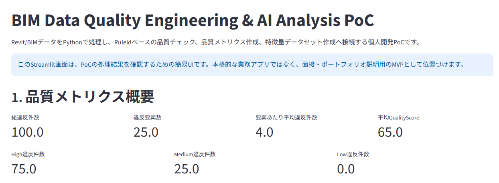
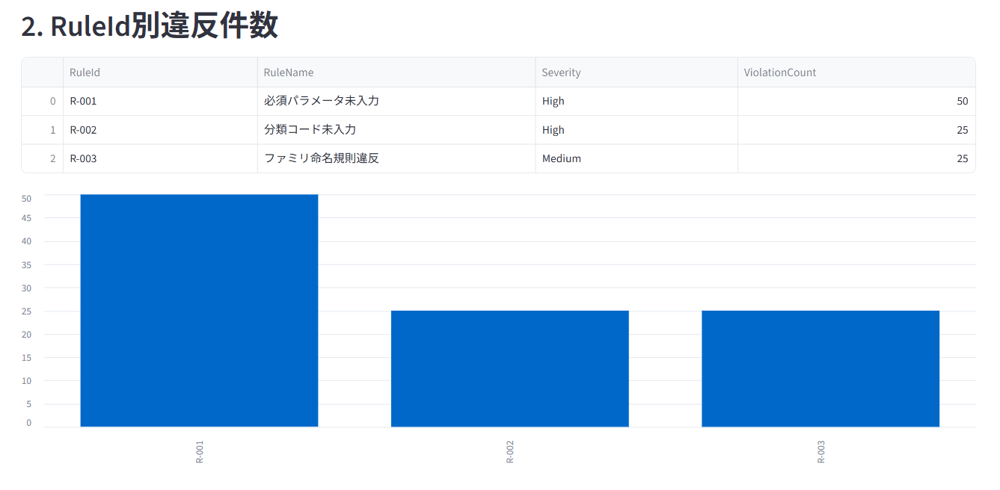
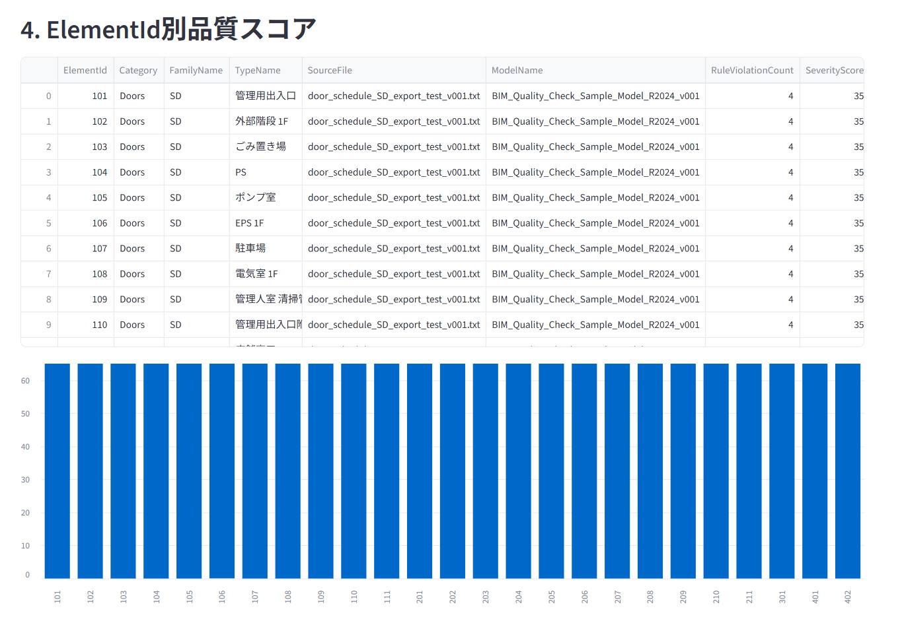
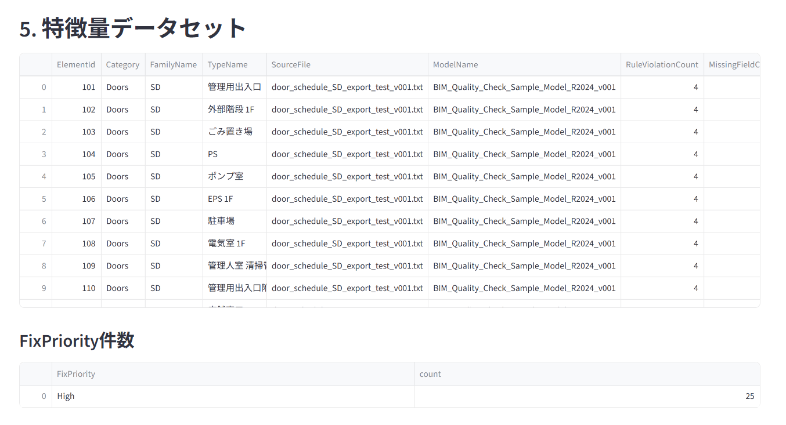
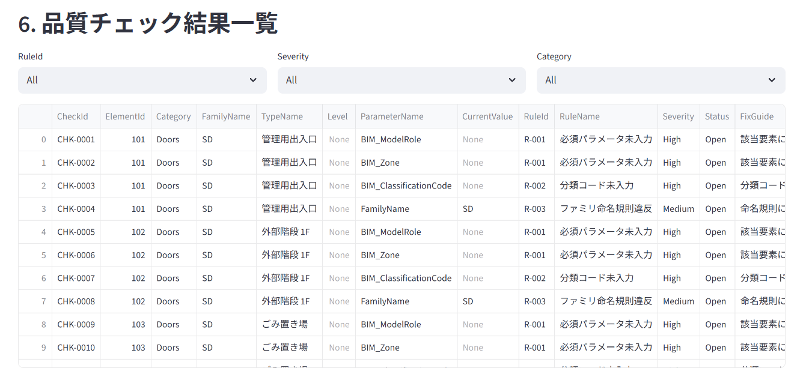

# BIM Data Quality Engineering & AI Analysis PoC

## Portfolio Document v001

---

## 1. 表紙

# BIM Data Quality Engineering & AI Analysis PoC

Revit/BIMデータを対象にした、PythonによるBIMデータ品質チェック・品質メトリクス作成・特徴量設計・Streamlit簡易可視化PoC

作成目的：

BIM導入支援の実務経験をもとに、建築BIMデータをAI・機械学習・データ分析で扱うための前処理パイプラインを個人PoCとして構築する。

使用技術：

- Python
- pandas
- Streamlit
- pytest
- CSV / TXT
- Revit Schedule Export
- Power BI
- RuleId-based Quality Check

---

## 2. 背景・課題

BIM導入支援やRevit運用支援の現場では、モデル内のパラメータ未入力、分類コード未入力、命名規則違反、属性情報のばらつきなどにより、集計、検索、品質管理、後工程確認、AI活用の精度が下がる課題があります。

BIMデータは、図面作成やモデル作成だけでなく、数量集計、品質確認、BI可視化、機械学習、生成AI、RAGなどへ接続できる可能性があります。

しかし、データ品質が低い状態では、AIやデータ分析にそのまま活用することは難しくなります。

このPoCでは、BIMデータ品質の課題を、Pythonによるデータ処理、RuleIdベース品質チェック、品質メトリクス作成、特徴量データセット作成、Streamlit簡易可視化へ接続する形で検証しました。

---

## 3. PoCの目的

このPoCの目的は、Revit/BIMデータをPythonで処理し、AI・機械学習・データ分析に利用しやすい構造化データへ変換することです。

本PoCでは、AIモデルそのものの精度を高く見せることではなく、AIや機械学習が扱えるBIMデータをどのように整備するかを重視しています。

実装した主な内容は以下です。

- Revit書き出しTXTの読み込み
- 品質チェック用CSVへの変換
- データクレンジング
- RuleIdベース品質チェック
- 品質チェック結果CSV出力
- 品質メトリクス作成
- QualityScore算出
- 特徴量データセット作成
- FixPriority仮ラベル作成
- Streamlit簡易画面による可視化

---

## 4. 処理フロー

```text
Revit書き出しTXT
↓
品質チェック用CSVへ変換
↓
データクレンジング
↓
RuleIdベース品質チェック
↓
品質チェック結果CSV出力
↓
品質メトリクス作成
↓
RuleId別・Category別・ElementId別集計
↓
QualityScore算出
↓
特徴量データセット作成
↓
FixPriority仮ラベル作成
↓
Streamlit簡易画面で可視化
```

主な成果物：

- `door_schedule_converted_v002.csv`
- `cleaned_bim_data_v001.csv`
- `check_results_revit_v002.csv`
- `quality_metrics_v001.csv`
- `element_summary_v001.csv`
- `bim_features_v001.csv`
- `app/streamlit_app.py`

---

## 5. 実装した機能

### Revit由来データ変換

Revitから書き出したドア建具表TXTをPython/pandasで読み込み、品質チェック用CSVへ変換しました。

### データクレンジング

変換後CSVに対して、列順整理、空欄処理、前後スペース削除、ElementId空欄行除外、重複行除外を行いました。

### RuleIdベース品質チェック

以下の品質ルールをRuleId付きで実装しました。

| RuleId | 内容 |
|---|---|
| R-001 | 必須パラメータ未入力 |
| R-002 | 分類コード未入力 |
| R-003 | ファミリ命名規則違反 |

品質チェック結果は、RuleId、RuleName、Severity、FixGuide付きのCSVとして出力しました。

---

## 6. 品質メトリクス・特徴量作成

品質チェック結果CSVから、以下の集計を作成しました。

- 総違反件数
- RuleId別違反件数
- Severity別違反件数
- Category別違反件数
- ElementId別違反件数
- SeverityScore
- QualityScore

さらに、機械学習や分析に使うための特徴量データセットを作成しました。

主な特徴量：

- RuleViolationCount
- MissingFieldCount
- HighViolationCount
- MediumViolationCount
- LowViolationCount
- HasClassificationCode
- FamilyNameValid
- SeverityScore
- QualityScore
- FixPriority

---

## 7. Streamlit簡易画面

Streamlitで、品質チェック結果、品質メトリクス、特徴量データセットを確認できる簡易画面を作成しました。

表示内容：

- 品質メトリクス概要
- RuleId別違反件数
- Category別違反件数
- ElementId別品質スコア
- 特徴量データセット
- FixPriority件数
- 品質チェック結果一覧
- RuleId / Severity / Category フィルタ
- CSVダウンロード

### Streamlit画面スクリーンショット

### Streamlit画面トップ

PoCの概要と主要な品質メトリクスを一覧できるトップ画面です。



### RuleId別違反件数

品質チェック結果をRuleId別に集計し、どの品質ルールで違反が多いかを確認できる画面です。



### ElementId別品質スコア

要素ごとの違反数、SeverityScore、QualityScoreを確認し、品質が低い要素を把握できる画面です。



### 特徴量データセット

品質チェック結果を、機械学習や分析に使える特徴量データセットへ変換した結果です。



### 品質チェック結果一覧

RuleId、Severity、Categoryでフィルタしながら、検出された品質違反の詳細を確認できる画面です。



---

<div style="page-break-before: always;"></div>

## 8. QualityScoreとFixPriority

### QualityScore

本PoCでは、BIM品質チェック結果をもとに、要素ごとの簡易品質スコアである `QualityScore` を作成しています。

初期設計では、100点を初期値とし、検出された違反の重大度に応じて減点します。

| Severity | 減点 |
|---|---:|
| High | 10点 |
| Medium | 5点 |
| Low | 1点 |

計算式：

```text
QualityScore = 100 - SeverityScore
```

今回の初期データでは、各要素にHigh違反3件、Medium違反1件が発生しているため、QualityScoreは65点となります。

### FixPriority

`FixPriority` は、修正優先度分類プロトタイプに接続するための仮ラベルです。

現時点では実務の正解ラベルではなく、QualityScoreとHigh違反件数をもとにしたPoC用の仮ラベルとして扱います。

---

## 9. 現時点の制約

現時点では、以下の制約があります。

- Revit由来データ対応は初期試作である
- `ElementId` はRevit内部ElementIdではなく、建具表上の建具番号を仮IDとして使用している
- `FamilyName` はRevitファミリ名ではなく、建具表上の種別記号を仮格納している
- `TypeName` はRevitタイプ名ではなく、設置場所・室名に近い列を仮格納している
- `QualityScore` はPoC用の簡易指標であり、実務上の正式な品質評価基準ではない
- `FixPriority` は実務の正解ラベルではなく、仮ラベルである
- 機械学習プロトタイプは未実装である
- 生成AI向け構造化コンテキスト生成は未実装である
- Revit APIやpyRevitとの直接連携は未実装である
- RevitモデルやBIMデータの自動修正は対象外である
- 設計判断、施工判断、モデル修正の最終判断は人間が行う前提である

---

## 10. 今後の拡張予定

今後は、7月応募可能MVPをもとに以下へ拡張します。

- scikit-learnによる修正優先度分類プロトタイプ
- classification_report、confusion_matrix、feature_importanceの出力
- 生成AI向け構造化コンテキスト生成
- RuleId、違反内容、重大度、品質スコア、修正優先度を含むJSON生成
- Streamlit画面の改善
- CSVアップロード機能
- Revit内部ElementId、FamilyName、TypeName、Levelの取得確認
- Revit API / pyRevit連携の検討
- GitHub公開用整理
- ポートフォリオPDF化
- 職務経歴書への反映

---

## 11. まとめ

7月時点では、Revit/BIMデータをPythonで処理し、品質チェック、品質メトリクス作成、特徴量データセット作成、Streamlit簡易可視化まで接続した応募可能MVPが完成しました。

このMVPにより、BIM導入支援の経験を、Python、データ処理、AI・機械学習活用前処理へ接続できることを示せます。

現時点では、実務適用可能な完成品ではなく、応募・面接で説明可能なPoC段階です。

ただし、単なる学習メモではなく、BIMデータをAI活用へ接続するための具体的な処理フロー、成果物、制約、今後の拡張方針を示せる状態になっています。