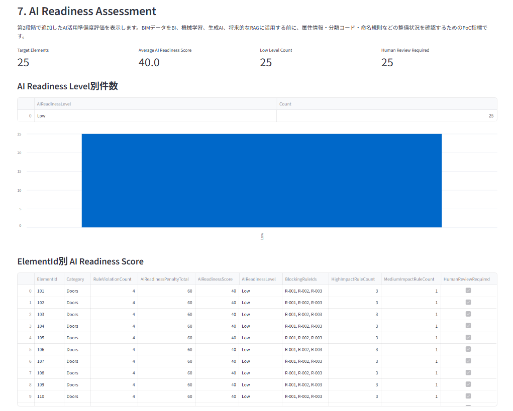
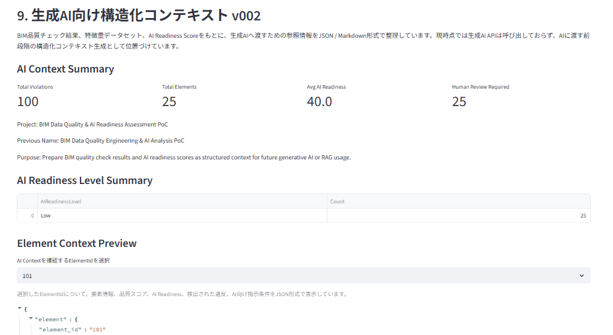
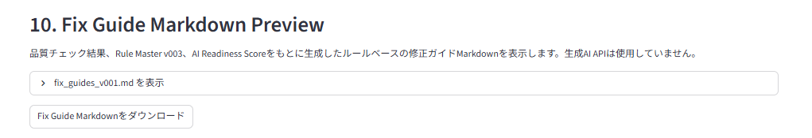
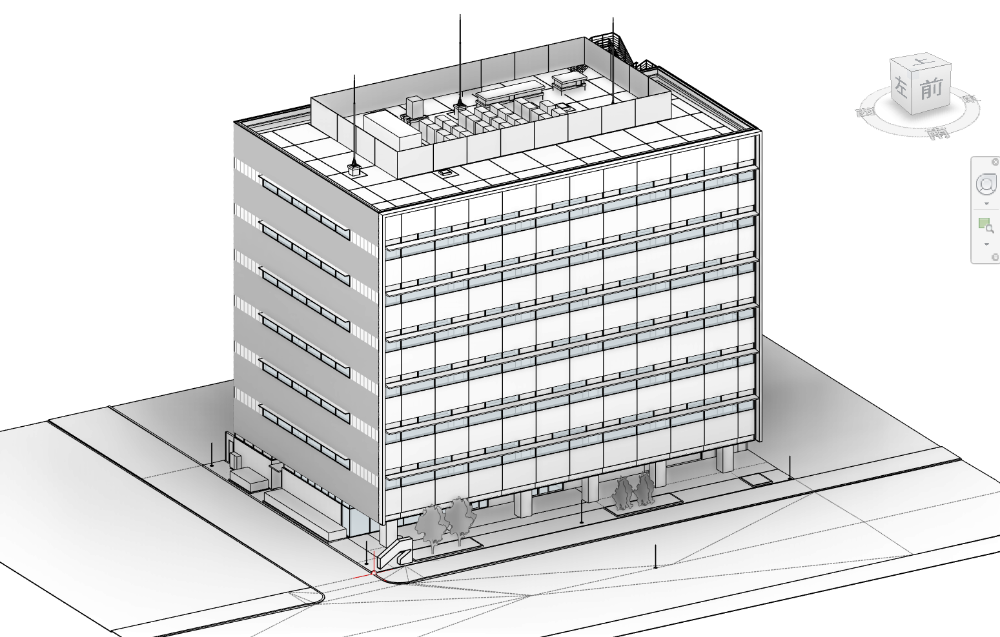
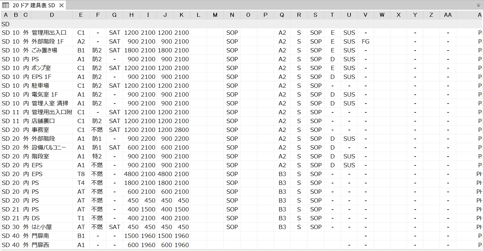
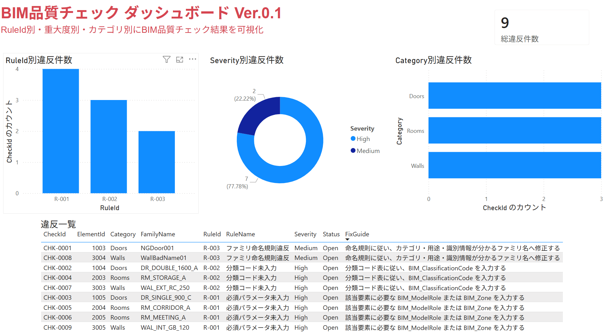

# BIM Data Quality & AI Readiness Assessment PoC

## BIMデータ品質・AI活用準備度評価PoC

A portfolio PoC for assessing BIM data quality and AI readiness before using Revit/BIM data for BI, data analysis, future machine learning, generative AI, or RAG.

Revit/BIMデータを、BI・データ分析・将来的な機械学習・生成AI・RAGで活用する前に、データ品質とAI活用準備度を評価するための個人開発PoCです。

Revit集計表から書き出したTXTをPythonで処理し、RuleIdベースの品質チェック、QualityScore算出、AI Readiness Score算出、生成AI向け構造化コンテキスト生成、Fix Guide Markdown生成、Streamlitによる簡易可視化までを実装しています。

---

## このPoCで示すこと

本PoCの目的は、AIにBIMデータをそのまま判断させることではありません。

BIMデータをAI・データ分析に使う前段階として、以下を整理・構造化することを目的としています。

* BIM品質ルール
* 品質チェック結果
* 重大度
* QualityScore
* AI Readiness Score
* 修正方針
* 人間確認が必要な箇所
* 生成AIやRAGへ渡すための構造化コンテキスト

BIM導入支援・Revit運用支援で扱ってきたデータ品質の課題を、Pythonによるデータ処理、品質評価、AI活用準備度評価へ接続することを重視しています。

---

## Portfolio Positioning

本PoCは、BIM導入支援・Revit運用支援の経験を、建設業界向けのAI・データ活用支援へ拡張するためのポートフォリオです。

汎用的なAIモデル開発や深層学習モデルの構築を目的とするものではありません。

BIMデータをBI、データ分析、将来的な機械学習、生成AI、RAGで活用する前段階として必要になる、データクレンジング、ルールベース品質チェック、品質指標化、AI活用準備度評価、構造化コンテキスト生成、修正ガイド生成の流れを示すことを目的としています。

---

## このPoCで示すスキル

本PoCでは、以下のスキルを示しています。

* BIM導入支援の観点から、BIMデータ品質上の課題を整理できること
* Revit集計表の書き出しデータをPythonで構造化データへ変換できること
* RuleIdベースでBIM品質チェックルールを設計・実装できること
* 品質チェック結果からQualityScore、AI Readiness Scoreを作成できること
* BIMデータをBI、データ分析、将来的な機械学習、生成AI、RAGで活用する前段階として整備できること
* 生成AI向けのJSON / Markdown構造化コンテキストを生成できること
* Streamlitで説明用MVPを作成できること
* pytestで主要ロジックの最小テストを作成できること
* 制約、未実装範囲、将来拡張を明確に説明できること

---

## なぜ作ったか

BIM導入支援の現場では、Revitモデルを作るだけでなく、BIMデータが後工程で使える品質になっているかが重要になります。

例えば、以下のような状態では、BI、データ分析、将来的な機械学習、生成AI、RAGにそのまま活用しにくくなります。

* 必須パラメータが未入力
* 分類コードが未入力
* 命名規則が統一されていない
* 属性情報にばらつきがある
* AIに渡す前提条件が整理されていない
* 人間確認が必要な箇所が明確でない

このPoCでは、BIMデータをAI活用する前に、データ品質、業務上のリスク、AI活用時の阻害要因を整理する流れを検証しています。

---

## 処理フロー

```text
Revit集計表TXT
↓
CSV変換
↓
データクレンジング
↓
RuleIdベース品質チェック
↓
品質メトリクス作成
↓
QualityScore算出
↓
特徴量データセット作成
↓
FixPriority分類プロトタイプ
↓
AI Readiness Score算出
↓
AI Context JSON / Markdown v002生成
↓
Fix Guide Markdown生成
↓
Streamlit簡易画面で可視化
```

---

## Current Results

現時点のサンプルデータに対する結果は以下です。

| 項目                  |           結果 |
| ------------------- | -----------: |
| 対象Revit集計表          | 20 ドア 建具表 SD |
| クレンジング後の入力行数        |           25 |
| 品質チェック結果            |         100件 |
| AI Readiness Score  |   25要素すべて 40 |
| AI Readiness Level  |          Low |
| HumanReviewRequired |         True |
| pytest              |    16 passed |

今回のサンプルでは、必須パラメータ未入力、分類コード未入力、命名規則違反が各要素で検出される設定のため、全要素のAI Readiness LevelがLowとなっています。

これらの結果は、小規模なサンプルデータとPoC用ルール設定に基づくものです。

実務上の正式なBIM品質評価基準ではありません。

---

## Demo Screenshots

### Streamlit - AI Readiness Assessment

AI Readiness Score、AI Readiness Level、HumanReviewRequired、ElementId別スコアを確認できる画面です。



### Streamlit - AI Context v002 Preview

品質チェック結果、特徴量データセット、AI Readiness Scoreをもとに生成した、AI向け構造化コンテキストを確認できる画面です。



### Streamlit - Fix Guide Preview

RuleId、Severity、AIReadinessImpact、HumanReviewRequiredをもとに生成した、人間確認向けの修正ガイドを確認できる画面です。



### Revit Sample Model

検証には、Autodesk公式の日本仕様 意匠サンプルモデル Revit 2024を使用しています。

`.rvt` ファイル本体は、容量および配布条件を考慮し、GitHub公開対象外としています。



### Revit Schedule Used

本PoCでは、Revit集計表 `20 ドア 建具表 SD` をTXTとして書き出し、Python処理の入力データとして使用しています。



### Power BI Dashboard

Power BIは補助的な可視化として使用しています。

`.pbix` ファイル本体は、容量および公開範囲を考慮し、GitHub公開対象外としています。



---

## 主な機能

詳細なルール仕様、データ辞書、評価方針、制約は `docs/` に整理しています。

### 1. Revit集計表TXTのCSV変換

Autodesk公式の日本仕様Revitサンプルモデルから書き出した集計表TXTを、Python/pandasで品質チェック用CSVへ変換します。

入力：

```text
03_input_csv/door_schedule_SD_export_test_v001.txt
```

出力：

```text
03_input_csv/door_schedule_converted_v002.csv
```

実装：

```text
src/convert_revit_schedule.py
```

---

### 2. データクレンジング

変換後CSVに対して、品質チェックや特徴量作成に使いやすい形へ整形します。

主な処理：

* 必要列の確認
* 不足列の追加
* NaNの空文字化
* 文字列の前後スペース削除
* ElementId空欄行の除外
* 重複行の除外

出力：

```text
03_input_csv/cleaned_bim_data_v001.csv
```

実装：

```text
src/clean_bim_data.py
```

---

### 3. RuleIdベース品質チェック

BIM品質チェックルールをRuleIdで管理し、クレンジング済みCSVに対して品質チェックを実行します。

ルールマスタ：

```text
02_rule_master/bim_rule_master_v002.csv
02_rule_master/bim_rule_master_v003.csv
```

初期ルール：

| RuleId | 内容         |
| ------ | ---------- |
| R-001  | 必須パラメータ未入力 |
| R-002  | 分類コード未入力   |
| R-003  | ファミリ命名規則違反 |

出力：

```text
04_output_csv/check_results_revit_v002.csv
```

実装：

```text
src/check_bim_quality.py
```

---

### 4. 品質メトリクスとQualityScore

品質チェック結果から、RuleId別、Category別、ElementId別の集計と、要素ごとのQualityScoreを作成します。

```text
QualityScore = 100 - SeverityScore
```

出力：

```text
04_output_csv/quality_metrics_v001.csv
04_output_csv/rule_summary_v001.csv
04_output_csv/category_summary_v001.csv
04_output_csv/element_summary_v001.csv
```

QualityScoreはPoC用の簡易指標であり、正式なBIM品質基準ではありません。

実装：

```text
src/calculate_quality_metrics.py
```

---

### 5. 特徴量データセット / FixPriority分類プロトタイプ

品質チェック結果をもとに、将来的な機械学習や分析に使うための特徴量データセットを作成します。

出力：

```text
04_output_csv/bim_features_v001.csv
```

scikit-learnによる修正優先度分類プロトタイプも実装しています。

ただし、現時点の `FixPriority` は実務の正解ラベルではなく、QualityScoreとHigh違反件数をもとにした仮ラベルです。

この分類プロトタイプは、機械学習モデルの精度を追求するものではなく、BIM品質チェック結果を特徴量化し、将来的な分類処理へ接続できることを確認するための初期実装です。

実装：

```text
src/create_bim_features.py
src/train_fix_priority_model.py
```

---

### 6. AI Readiness Score

Rule Master v003と品質チェック結果をもとに、ElementIdごとのAI Readiness Scoreを算出します。

AI Readiness Scoreは、BIMデータがBI、データ分析、将来的な機械学習、生成AI、RAGに活用できる状態かを簡易評価するためのPoC用指標です。

```text
AIReadinessScore = 100 - AIReadinessPenaltyTotal
```

出力：

```text
04_output_csv/ai_readiness_scores_v001.csv
```

AI Readiness Scoreは正式なBIM品質基準ではありません。
実務導入時には、BIM実行計画書、発注者情報要件、分類体系、AIの利用目的、プロジェクトフェーズに応じて調整する必要があります。

実装：

```text
src/calculate_ai_readiness_score.py
```

---

### 7. AI Context JSON / Markdown v002

品質チェック結果、特徴量データセット、AI Readiness Scoreをもとに、将来的な生成AIやRAGへ渡す前段階の構造化コンテキストをJSON / Markdown形式で生成します。

出力：

```text
04_output_csv/ai_context_v002.json
04_output_csv/ai_context_v002.md
```

含める主な情報：

* ElementId
* Category
* RuleId
* Severity
* QualityScore
* FixPriority
* AIReadinessScore
* AIReadinessLevel
* BlockingRuleIds
* HumanReviewRequired
* FixGuide

現時点では、OpenAI API、Azure OpenAI、その他の生成AI APIは呼び出していません。

実装：

```text
src/generate_ai_context.py
```

---

### 8. Fix Guide Markdown

品質チェック結果、Rule Master v003、AI Readiness Scoreをもとに、RuleIdベースの修正ガイドMarkdownを生成します。

出力：

```text
04_output_csv/fix_guides_v001.md
```

この処理では生成AI APIは使用していません。
RuleId、Severity、AIReadinessImpact、AIReadinessPenalty、FixGuideをもとに、テンプレート方式で人間確認向けの修正方針を出力しています。

実装：

```text
src/generate_fix_guide.py
```

---

### 9. Streamlit簡易画面

品質チェック結果、品質メトリクス、特徴量データセット、AI Readiness Score、AI Context v002、Fix Guide Markdownを確認できる簡易UIです。

実行：

```powershell
streamlit run .\app\streamlit_app.py
```

この画面は本格的な業務アプリではなく、面接・ポートフォリオ説明用のMVPとして位置づけています。

実装：

```text
app/streamlit_app.py
```

---

## Portfolio PDF

PoCの概要、処理フロー、スクリーンショット、制約、今後の拡張方針は、以下のポートフォリオPDFに整理しています。

```text
07_portfolio/bim_quality_poc_portfolio_v003.pdf
```

このPDFを、提出・説明用の主なポートフォリオ資料として位置づけています。

---

## Tests

pytestによる最小テストを作成しています。

```text
tests/test_quality_rules.py
tests/test_ai_readiness_score.py
```

実行：

```powershell
python -m pytest tests -v
```

現在の結果：

```text
collected 16 items
16 passed
```

テストでは、RuleIdベース品質チェック、AI Readiness Score計算、HumanReviewRequired判定などの基本動作を確認しています。

---

## Tech Stack

* Python 3.12.10
* pandas
* scikit-learn
* pytest
* Streamlit
* CSV / TXT
* JSON / Markdown
* Revit Schedule Export
* Power BI Desktop

将来的な拡張候補：

* pyRevit
* Revit API
* Local LLM
* RAG
* Azure AI Search
* Azure OpenAI / 生成AI API

---

## Setup

リポジトリフォルダへ移動します。

```powershell
cd path\to\bim_quality_poc
```

必要なライブラリをインストールします。

```powershell
python -m pip install -r requirements.txt
```

テストを実行します。

```powershell
python -m pytest tests -v
```

Streamlitアプリを起動します。

```powershell
streamlit run .\app\streamlit_app.py
```

---

## Repository Structure

```text
bim_quality_poc/
├── README.md
├── requirements.txt
├── .gitignore
├── app/
│   └── streamlit_app.py
├── 01_revit_model/
│   └── README.md
├── 02_rule_master/
│   ├── bim_rule_master_v002.csv
│   └── bim_rule_master_v003.csv
├── 03_input_csv/
│   ├── cleaned_bim_data_v001.csv
│   ├── door_schedule_SD_export_test_v001.txt
│   └── door_schedule_converted_v002.csv
├── 04_output_csv/
│   ├── ai_context_v002.json
│   ├── ai_context_v002.md
│   ├── ai_readiness_scores_v001.csv
│   ├── bim_features_v001.csv
│   ├── category_summary_v001.csv
│   ├── check_results_revit_v002.csv
│   ├── element_summary_v001.csv
│   ├── fix_guides_v001.md
│   ├── fix_priority_classification_report_v001.csv
│   ├── fix_priority_confusion_matrix_v001.csv
│   ├── fix_priority_predictions_v001.csv
│   ├── quality_metrics_v001.csv
│   └── rule_summary_v001.csv
├── 05_powerbi/
│   └── README.md
├── 07_portfolio/
│   ├── bim_quality_poc_portfolio_v003.pdf
│   └── screenshots/
│       ├── powerbi_dashboard_v001.png
│       ├── revit_sample_model_3d_view.png
│       ├── revit_door_schedule_view.png
│       ├── streamlit_ai_readiness_overview_v001.png
│       ├── streamlit_ai_context_preview_v001.png
│       └── streamlit_fix_guide_preview_v001.png
├── docs/
├── src/
└── tests/
```

---

## Documentation

詳細資料は `docs/` に整理しています。

主な資料：

```text
docs/system_overview.md
docs/data_dictionary.md
docs/rule_specification.md
docs/evaluation_policy.md
docs/limitations.md
docs/ai_readiness_assessment_plan.md
docs/revit_schedule_column_mapping.md
docs/revit_api_pyrevit_integration_plan.md
docs/portfolio_summary.md
```

---

## Limitations / Out of Scope

現時点の主な制約と対象外は以下です。

* Revit由来データ対応は初期試作です。
* 現在処理しているRevit由来データはドア建具表のみです。
* `ElementId` はRevit内部ElementIdではなく、建具表上の建具番号を仮IDとして使用しています。
* `FamilyName` と `TypeName` は、現時点ではRevit集計表の列をもとにした仮マッピングです。
* QualityScoreとAI Readiness ScoreはPoC用の簡易指標です。
* FixPriorityは実務の正解ラベルではなく仮ラベルです。
* 生成AI API接続、RAG、Azure AI Search連携、Revit API / pyRevitによる直接取得は未実装です。
* Revitモデルの自動修正は対象外です。
* 設計判断、施工判断、モデル修正の最終判断は人間が行う前提です。
* 深層学習、機械学習モデルの精度追求、複雑なPower BIダッシュボード再設計は対象外です。

詳細は以下に整理しています。

```text
docs/limitations.md
docs/evaluation_policy.md
docs/data_dictionary.md
docs/revit_schedule_column_mapping.md
docs/ai_readiness_assessment_plan.md
```

---

## Future Work

今後の拡張候補は以下です。

### Revit / BIM連携

* Revit内部ElementIdの取得
* UniqueId、FamilyName、TypeName、Category、Level、RoomNameの取得
* pyRevit / Revit API連携の検討
* Revitモデルから直接取得したデータを既存品質チェックパイプラインへ接続

### AI / RAG連携

* AI Context v002を将来的なAIワークフローの入力として活用
* Local LLMによる検証
* RAG構成の検討
* Azure AI Search連携の検討
* 生成AI API接続の検討

### Data / ML拡張

* 実務修正履歴を使ったFixPriority教師データ設計
* AI Readiness Score基準の実務向け調整
* ドア以外のカテゴリ、特にRoomやWallへの拡張

---

## Summary

本PoCでは、Revit/BIMデータを対象に、Python/pandasによるデータ読み込み、データクレンジング、RuleIdベース品質チェック、品質メトリクス作成、QualityScore算出、特徴量データセット作成、AI Readiness Score算出、生成AI向け構造化コンテキスト生成、Fix Guide Markdown生成、Streamlit簡易可視化、pytestによる最小テストまでを実装しました。

目的は、AIモデルそのものを作ることではなく、BIMデータをBI、データ分析、将来的な機械学習、生成AI、RAGで安全に活用するための前処理、品質評価、構造化、修正ガイド生成の流れを示すことです。

このPoCにより、BIM導入支援・Revit運用支援の経験を、建設業界向けのAI・データ活用支援へ拡張できることを示しています。
