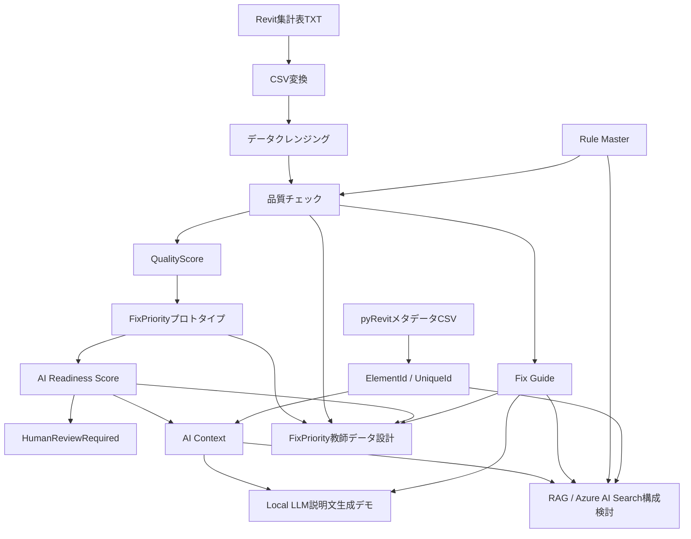
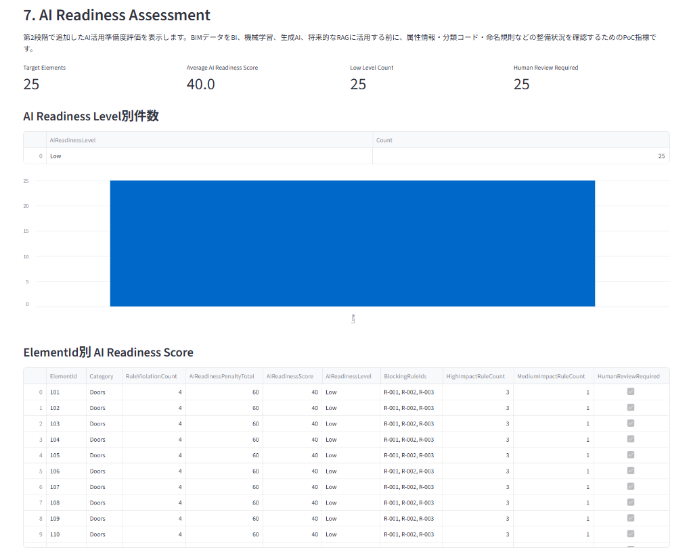
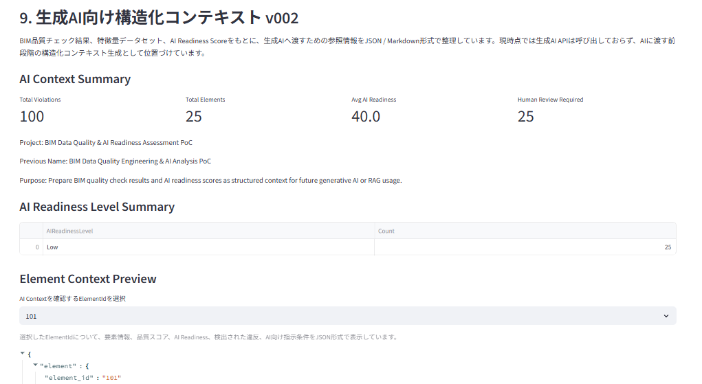
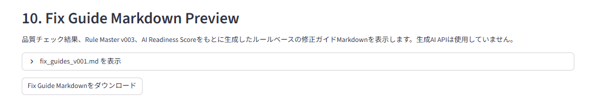
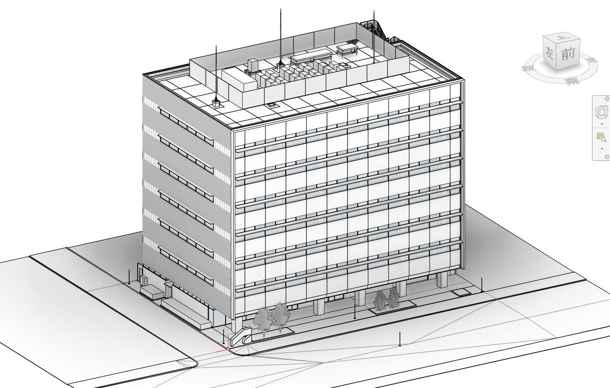
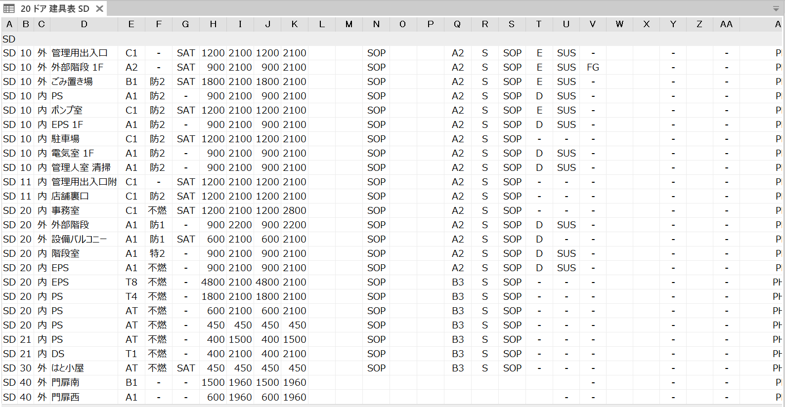
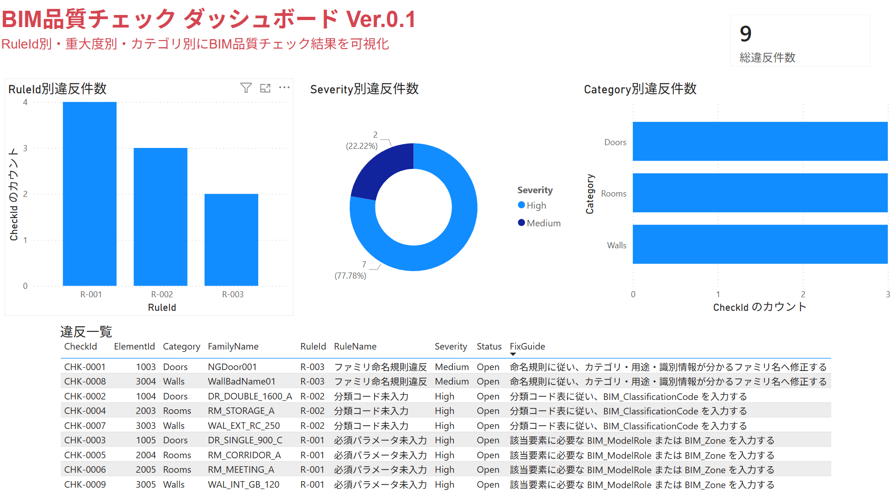

# BIM Data Quality & AI Readiness Assessment PoC

## BIMデータ品質・AI活用準備度評価PoC

Revit / BIMデータを、BI・データ分析・将来的な機械学習・生成AI・RAGで活用する前に、データ品質とAI活用準備度を評価するための個人開発PoCです。

Revit集計表から書き出したTXT、Room Schedule TXT、pyRevitで取得した選択要素メタデータCSVをPythonで処理し、RuleIdベースの品質チェック、QualityScore算出、AI Readiness Score算出、生成AI向け構造化コンテキスト生成、Fix Guide Markdown生成、Streamlitによる簡易可視化、ローカルLLMによる説明文生成デモ、RAG / Azure AI Search構成検討、FixPriority教師データ設計までを扱っています。

本PoCの目的は、AIに設計判断・施工判断・法規判断をさせることではありません。
BIM担当者が確認・判断しやすいように、品質チェック結果、AI Readiness、修正方針、人間確認要否、RAG向け構造を整理することを目的としています。

---

## Portfolio PDF

[Portfolio PDF v005](07_portfolio/bim_quality_poc_portfolio_v005.pdf)

---

## 全体フロー図

このPoCは、BIMデータをLLM、RAG、BI、将来的な機械学習で活用する前段階として、データ品質とAI活用準備度を評価するものです。

AIが設計判断・施工判断・法規判断を行うものではなく、Revitモデルの自動修正も行いません。
最終判断はBIM担当者が行う前提です。


```mermaid
flowchart TD
    A[Revit集計表TXT] --> B[CSV変換]
    B --> C[データクレンジング]
    C --> D[品質チェック]

    R[Rule Master] --> D

    D --> E[QualityScore]
    E --> F[FixPriorityプロトタイプ]
    F --> G[AI Readiness Score]
    G --> H[HumanReviewRequired]
    G --> I[AI Context]
    D --> J[Fix Guide]

    I --> K[Local LLM説明文生成デモ]
    J --> K

    I --> L[RAG / Azure AI Search構成検討]
    J --> L
    R --> L

    F --> M[FixPriority教師データ設計]
    D --> M
    G --> M
    J --> M

    P[pyRevitメタデータCSV] --> Q[ElementId / UniqueId]
    Q --> I
    Q --> L
```

関連する図解設計資料：

```text
docs/portfolio_visual_plan.md
docs/poc_overall_flow_mermaid.md
docs/phase3_extension_mermaid.md
```

---

## このPoCで示すこと

本PoCでは、AIモデルそのものを作るのではなく、BIMデータをAI・データ分析・RAGに渡す前段階の整備を重視しています。

主に以下を示しています。

* Revit集計表TXTを構造化CSVへ変換すること
* Door / Roomデータを品質チェックしやすい形へ整理すること
* RuleIdベースでBIM品質チェックを設計・実装すること
* QualityScoreとAI Readiness Scoreを算出すること
* 人間確認が必要な箇所をHumanReviewRequiredとして明示すること
* 生成AIやRAGへ渡すためのAI Context JSON / Markdownを生成すること
* BIM担当者向けのFix Guide Markdownを生成すること
* ローカルLLMで説明文生成デモを行い、人間レビューと分けて扱うこと
* pyRevitでRevit内部ElementId / UniqueIdを取得するMVPを作ること
* RAG / Azure AI Searchを想定したチャンク設計・メタデータ設計を行うこと
* FixPriorityを将来的な教師データ候補として扱うための列設計・ラベル方針を整理すること
* pytestで主要ロジックを検証すること

---

## Current Results

### Door Category Results

| 項目                  |           結果 |
| ------------------- | -----------: |
| 対象Revit集計表          | 20 ドア 建具表 SD |
| クレンジング後の入力行数        |           25 |
| 品質チェック結果            |         100件 |
| AI Readiness Score  |   25要素すべて 40 |
| AI Readiness Level  |          Low |
| HumanReviewRequired |         True |

Doorサンプルでは、必須パラメータ未入力、分類コード未入力、命名規則違反が各要素で検出される設定のため、全要素のAI Readiness LevelがLowとなっています。

---

### Phase 3B Room Category Results

| 項目                        |                    結果 |
| ------------------------- | --------------------: |
| Total Room records        |                   113 |
| Room rule violations      |                    11 |
| Violated Room elements    |                    11 |
| Clean Room elements       |                   102 |
| Average Room QualityScore |                 99.03 |
| Room AI Readiness Level   |             High: 113 |
| HumanReviewRequired       | True: 11 / False: 102 |

Phase 3Bでは、既存のDoor中心ワークフローをRoomカテゴリにも拡張しました。

---

### Phase 3C pyRevit Element Metadata Export Results

Phase 3Cでは、Revit集計表TXTだけでなく、pyRevitを使ってRevitモデル上の選択要素から内部メタデータを取得する小規模MVPを追加しました。

確認済み：

| 項目                                 | 結果                         |
| ---------------------------------- | -------------------------- |
| Revit / pyRevit環境                  | Revit 2024 / pyRevit 6.4.0 |
| BIM Qualityタブ / Export Metadataボタン | 作成済み                       |
| 0件選択時の安全中断                         | 確認済み                       |
| Door 1件選択時のCSV出力                   | 確認済み                       |
| Door複数選択時のCSV出力                    | 確認済み                       |
| ElementId / UniqueId取得             | 確認済み                       |
| Category / FamilyName / TypeName取得 | 確認済み                       |
| LevelName取得                        | 確認済み                       |
| 匿名化サンプルCSV                         | 作成済み                       |

Phase 3Cでは、Revitモデルの自動修正やパラメータ書き換えは行っていません。

---

## Phase 3A〜3E 拡張内容

### Phase 3A: Local LLM Explanation Demo

AI ContextとFix Guideを入力情報として、ローカルLLMでBIM担当者向け説明文を生成できるかを小さく検証しました。

目的はLLM性能比較ではなく、AI Contextが説明文生成の入力として機能するかを確認することです。
LLM回答は参考情報であり、最終判断はBIM担当者が行う前提です。

主な関連ファイル：

```text
docs/local_llm_extension_plan.md
docs/local_llm_prompt_template.md
docs/local_llm_experiment.md
06_local_llm/README.md
06_local_llm/local_llm_prompt_input_sample_v001.md
06_local_llm/local_llm_explanation_examples_v001.md
```

---

### Phase 3B: Room Category Extension

Door中心だった品質チェック・AI Readiness Assessmentを、Room Schedule TXTにも適用できるように拡張しました。

主な関連ファイル：

```text
src/convert_room_schedule.py
src/clean_room_data.py
src/check_room_quality.py
src/calculate_room_quality_metrics.py
src/calculate_room_ai_readiness_score.py
src/generate_room_ai_context.py
src/generate_room_fix_guide.py
tests/test_room_pipeline.py
docs/phase3b_room_category_completion_summary.md
```

---

### Phase 3C: pyRevit Element Metadata Export MVP

pyRevitを使い、Revitモデル上の選択要素からElementId / UniqueIdなどの基本メタデータをCSV出力するMVPを追加しました。

主な関連ファイル：

```text
pyrevit_scripts/export_selected_element_metadata.py
03_input_csv/pyrevit_element_metadata_sample_v001.csv
docs/pyrevit_element_metadata_export_plan.md
docs/pyrevit_element_metadata_mapping.md
docs/pyrevit_limitations.md
tests/test_pyrevit_metadata_csv.py
```

---

### Phase 3D: RAG / Azure AI Search Architecture Design

既存PoC成果物を将来的にRAG / Azure AI Searchで扱う場合の構成検討を追加しました。

AI Context、Fix Guide、Rule Master、Door / Room品質チェック結果、AI Readiness Score、pyRevit Metadataを、将来の検索・回答生成に接続する場合の設計方針を整理しています。

主な関連ファイル：

```text
docs/rag_azure_ai_search_architecture_plan.md
docs/rag_chunk_design.md
docs/rag_metadata_design.md
docs/rag_query_examples.md
docs/rag_answer_policy.md
docs/rag_limitations.md
05_rag_design/sample_index_schema_v001.json
05_rag_design/sample_rag_documents_v001.jsonl
```

この段階では、Azure AI Search、Azure OpenAI / OpenAI API、Embedding生成、ベクトル検索、RAGチャットUIは実装していません。

---

### Phase 3E: FixPriority Training Data Design

FixPriorityを将来的な教師データ候補として扱うための設計を追加しました。

この段階では、機械学習モデルの作成、深層学習、fine-tuning、FixPriorityの完全自動判定は行っていません。

主な関連ファイル：

```text
docs/fixpriority_training_data_design.md
docs/fixpriority_training_columns.md
docs/fixpriority_labeling_policy.md
docs/fixpriority_limitations.md
07_fixpriority_training/fixpriority_training_samples_v001.csv
07_fixpriority_training/fixpriority_label_examples_v001.md
tests/test_fixpriority_training_data.py
```

---

## Demo Screenshots

### Streamlit - AI Readiness Assessment

AI Readiness Score、AI Readiness Level、HumanReviewRequired、ElementId別スコアを確認できる画面です。



### Streamlit - AI Context v002 Preview

品質チェック結果、特徴量データセット、AI Readiness Scoreをもとに生成した、AI向け構造化コンテキストを確認できる画面です。



### Streamlit - Fix Guide Preview

RuleId、Severity、AIReadinessImpact、HumanReviewRequiredをもとに生成した、人間確認向けの修正ガイドを確認できる画面です。



### Revit Sample Model

検証には、Autodesk公式の日本仕様 意匠サンプルモデル Revit 2024を使用しています。
`.rvt` ファイル本体は、容量および配布条件を考慮し、GitHub公開対象外としています。



### Revit Schedule Used

本PoCでは、Revit集計表 `20 ドア 建具表 SD` をTXTとして書き出し、Python処理の入力データとして使用しています。



### Power BI Dashboard

Power BIは補助的な可視化として使用しています。
`.pbix` ファイル本体は、容量および公開範囲を考慮し、GitHub公開対象外としています。



---

## 主な出力ファイル

### Door関連

```text
04_output_csv/check_results_revit_v002.csv
04_output_csv/quality_metrics_v001.csv
04_output_csv/ai_readiness_scores_v001.csv
04_output_csv/ai_context_v002.json
04_output_csv/ai_context_v002.md
04_output_csv/fix_guides_v001.md
```

### Room関連

```text
04_output_csv/check_results_room_v001.csv
04_output_csv/room_quality_metrics_v001.csv
04_output_csv/room_ai_readiness_scores_v001.csv
04_output_csv/room_ai_context_v001.json
04_output_csv/room_ai_context_v001.md
04_output_csv/room_fix_guides_v001.md
```

### pyRevit関連

```text
03_input_csv/pyrevit_element_metadata_sample_v001.csv
pyrevit_scripts/export_selected_element_metadata.py
```

### Local LLM関連

```text
06_local_llm/README.md
06_local_llm/local_llm_prompt_input_sample_v001.md
06_local_llm/local_llm_explanation_examples_v001.md
```

### RAG設計関連

```text
05_rag_design/sample_index_schema_v001.json
05_rag_design/sample_rag_documents_v001.jsonl
```

### FixPriority教師データ設計関連

```text
07_fixpriority_training/fixpriority_training_samples_v001.csv
07_fixpriority_training/fixpriority_label_examples_v001.md
```

---

## Tests

pytestで主要ロジックの最小テストを作成しています。

主なテスト：

```text
tests/test_quality_check.py
tests/test_ai_readiness_score.py
tests/test_room_pipeline.py
tests/test_pyrevit_metadata_csv.py
tests/test_fixpriority_training_data.py
```

実行：

```powershell
$env:PYTHONPATH = "."
pytest -q
```

確認済み：

```text
37 passed
```

RuleIdベース品質チェック、AI Readiness Score計算、HumanReviewRequired判定、Room用処理、pyRevit出力CSV、FixPriority教師データCSVの基本整合性を確認しています。

---

## Tech Stack

主に使用している技術：

```text
Python
pandas
pytest
Streamlit
Markdown
CSV
JSON
JSONL
Revit Schedule TXT
pyRevit
Revit API
Ollama
LM Studio
Local LLM
Mermaid
```

将来的な拡張候補：

```text
Power BI
Azure AI Search
Azure OpenAI
OpenAI API
Embedding
Vector Search
RAG
FastAPI
```

ただし、Phase 3D時点ではAzure AI Search、Azure OpenAI / OpenAI API、Embedding生成、Vector Search、RAG UIは未実装です。

---

## Documentation

詳細資料は `docs/` に整理しています。

主要資料：

```text
docs/project_overview.md
docs/rule_specification.md
docs/evaluation_policy.md
docs/limitations.md
docs/data_dictionary.md
docs/phase3_roadmap.md
docs/poc_completion_policy.md
docs/portfolio_pdf_update_plan.md
docs/readme_simplification_plan.md
```

Phase別資料：

```text
docs/local_llm_extension_plan.md
docs/room_category_extension_plan.md
docs/pyrevit_element_metadata_export_plan.md
docs/rag_azure_ai_search_architecture_plan.md
docs/fixpriority_training_data_design.md
```

図解・Portfolio関連：

```text
docs/portfolio_visual_plan.md
docs/poc_overall_flow_mermaid.md
docs/phase3_extension_mermaid.md
07_portfolio/bim_quality_poc_portfolio_v004.pdf
```

---

## Limitations / Out of Scope

現時点の主な制約と対象外は以下です。

* 本PoCは検証用であり、本番用のBIM品質管理システムではありません。
* 現在処理しているRevit由来データは、主にDoor ScheduleとRoom Scheduleです。
* Door / RoomのElementIdには、PoC用仮IDとRevit内部ElementIdが混在する可能性があります。
* QualityScoreとAI Readiness ScoreはPoC用の簡易指標です。
* FixPriorityは実務の正解ラベルではなく、仮ラベルです。
* FixPriority教師データ設計は列設計・ラベル方針・サンプル作成までであり、分類モデルの作成は行っていません。
* Local LLMの出力は参考情報であり、最終判断ではありません。
* pyRevit連携は、選択要素のメタデータCSV出力MVPまでです。
* 全モデルスキャンは未実装です。
* Azure AI Searchの実デプロイは未実装です。
* Azure OpenAI / OpenAI API接続は未実装です。
* Embedding生成は未実装です。
* ベクトル検索は未実装です。
* RAGチャットUIは未実装です。
* 機械学習モデル作成、深層学習、fine-tuningは未実装です。
* Revitモデルの自動修正は対象外です。
* 設計判断、施工判断、法規判断、モデル修正の最終判断はBIM担当者が行う前提です。

---

## Security / Public Data Policy

このリポジトリには、公開可能なサンプルデータまたは匿名化したPoC用データのみを含めます。

GitHubに含めないもの：

```text
実案件データ
顧客名
プロジェクト名
個人情報
社外秘モデル由来情報
実モデル由来のUniqueId
実モデル由来のElementId
APIキー
接続文字列
Azureリソース名
.env
ログファイル
モデルファイル
キャッシュ
```

---

## Summary

本PoCでは、Revit / BIMデータを対象に、Pythonによるデータ変換、データクレンジング、RuleIdベース品質チェック、QualityScore算出、AI Readiness Score算出、生成AI向け構造化コンテキスト生成、Fix Guide Markdown生成、Streamlit簡易可視化、Local LLM説明文生成デモ、pyRevitメタデータ取得、RAG構成検討、FixPriority教師データ設計、pytestによる最小テストまでを整理しました。

目的は、AIモデルそのものを作ることではなく、BIMデータをBI、データ分析、将来的な機械学習、生成AI、RAGで安全に活用するための前処理、品質評価、構造化、修正ガイド生成、人間レビュー設計の流れを示すことです。

このPoCにより、BIM導入支援・Revit運用支援の経験を、建設業界向けのAI・データ活用支援へ拡張できることを示しています。
