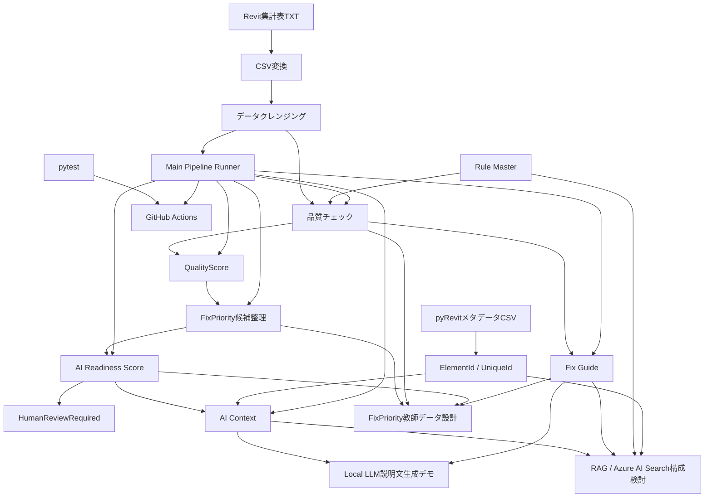

# BIM Data Quality & AI Readiness Assessment PoC

## BIMデータ品質・AI活用準備度評価PoC

本PoCは、BIM導入支援・Revit運用支援の経験を、建設業界向けAI導入支援・BIMデータ活用支援へ拡張するためのポートフォリオです。

Revit / BIMデータを、BI・データ分析・将来的な機械学習・生成AI・RAGで活用する前に、データ品質とAI活用準備度を評価するための個人開発PoCです。

This portfolio demonstrates how BIM implementation support experience can be extended into construction AI and data utilization support by preparing Revit-derived BIM data for BI, RAG, machine learning workflows, and human-reviewed AI assistance.

Revit集計表から書き出したTXT、Room Schedule TXT、pyRevitで取得した選択要素メタデータCSVをPythonで処理し、RuleIdベースの品質チェック、QualityScore算出、AI Readiness Score算出、生成AI向け構造化コンテキスト生成、Fix Guide Markdown生成、Streamlitによる簡易可視化、ローカルLLMによる説明文生成デモ、RAG / Azure AI Search構成検討、FixPriority教師データ設計、分類処理経路の検証までを扱っています。

また、PoCの再現性を高めるため、Python仮想環境からの依存関係再構築、主要処理の一括実行ランナー、pytestによる自動テスト、GitHub Actionsによる継続的インテグレーションを追加しています。

本PoCの目的は、AIに設計判断・施工判断・法規判断をさせることではありません。

BIM担当者が確認・判断しやすいように、品質チェック結果、AI Readiness、修正方針、人間確認要否、RAG向け構造を整理することを目的としています。

---

## Portfolio PDF

[Portfolio PDF v005](07_portfolio/bim_quality_poc_portfolio_v005.pdf)

---

## Quick Start / 再現手順

### 前提環境

確認済み環境：

```text
Python 3.12.10
pip 26.1.1
pandas 2.3.3
pytest 9.0.3
scikit-learn 1.8.0
streamlit 1.52.1
```

本PoCでは、Python 3.12環境での動作を確認しています。

### 1. リポジトリを取得

```powershell
git clone https://github.com/takahashi-365/bim-quality-poc.git
cd bim-quality-poc
```

開発ブランチを確認する場合：

```powershell
git checkout refactor/poc1-reliability
```

### 2. 仮想環境を作成

Windows PowerShell：

```powershell
python -m venv .venv
```

### 3. 仮想環境を有効化

```powershell
.\.venv\Scripts\Activate.ps1
```

### 4. 依存関係をインストール

```powershell
python -m pip install --upgrade pip
python -m pip install -r requirements.txt
```

### 5. テストを実行

```powershell
python -m pytest -v
```

確認済み結果：

```text
44 passed
```

### 6. 主要パイプラインを一括実行

```powershell
python scripts\run_pipeline.py
```

正常終了時：

```text
PIPELINE COMPLETED
Total steps: 7
```

PowerShellで終了コードを確認する場合：

```powershell
$LASTEXITCODE
```

期待結果：

```text
0
```

---

## Main Pipeline Runner

主要なDoor関連処理は、次のランナーから一括実行できます。

```text
scripts/run_pipeline.py
```

実行コマンド：

```powershell
python scripts\run_pipeline.py
```

### 実行される処理

```text
1. BIM quality check
2. Quality metrics calculation
3. BIM feature creation
4. FixPriority model workflow
5. AI readiness assessment
6. AI context generation
7. Fix guide generation
```

対応するスクリプト：

```text
src/check_bim_quality.py
src/calculate_quality_metrics.py
src/create_bim_features.py
src/train_fix_priority_model.py
src/calculate_ai_readiness_score.py
src/generate_ai_context.py
src/generate_fix_guide.py
```

### ランナーの確認内容

各ステップで、以下を確認します。

```text
対象スクリプトが存在すること
サブプロセスの終了コードが0であること
期待する出力ファイルが生成されること
生成ファイルが0バイトではないこと
処理失敗時に後続処理を停止すること
CIで利用可能な終了コードを返すこと
```

### 入力に関する注意

主要パイプラインランナーは、次のクレンジング済みDoor CSVを入力として開始します。

```text
03_input_csv/cleaned_bim_data_v001.csv
```

現時点では、Revit集計表TXTからCSVへの変換、およびDoorデータのクレンジング処理は、一括実行ランナーの対象外です。

Room関連処理も、現在は別系統の処理として管理しています。

---

## Continuous Integration

GitHub Actionsを使用し、pushまたはPull Request時にテストと主要パイプラインを自動実行します。

ワークフロー：

```text
.github/workflows/python-ci.yml
```

### 実行条件

```text
mainブランチへのpush
refactor/poc1-reliabilityブランチへのpush
mainブランチを対象とするPull Request
GitHub Actions画面からの手動実行
```

### CI環境

```text
Runner: ubuntu-latest
Python: 3.12
Dependency file: requirements.txt
```

### CIで実行する処理

```text
1. リポジトリをチェックアウト
2. Python 3.12をセットアップ
3. pip依存関係キャッシュを復元
4. requirements.txtをインストール
5. pytestを実行
6. 主要パイプラインを実行
```

GitHub Actionsで、テストおよび主要パイプラインが正常終了することを確認済みです。

---

## このPoCでできること / できないこと

### できること

```text
Revit由来データの品質チェック
RuleIdベースの違反検出
QualityScore算出
AI Readiness Score算出
HumanReviewRequired判定
AI Context JSON / Markdown生成
Fix Guide Markdown生成
Streamlitによる簡易可視化
ローカルLLMによる説明文生成デモ
pyRevitによるElementId / UniqueId取得MVP
RAG / Azure AI Search向けの構成検討
FixPriority教師データの列設計・ラベル方針整理
FixPriority分類処理経路の実行確認
単一クラス時のDummyClassifierによる処理確認
分類レポート・混同行列・予測結果CSVの生成
pytestによる主要ロジックと実行構成の検証
主要Doorパイプラインの一括実行
GitHub Actionsによるテストとパイプラインの自動実行
```

### できないこと / 対象外

```text
Revitモデルの自動修正
設計判断
施工判断
法規判断
本番用BIM品質管理システムとしての運用
生のRevit集計表TXTから全処理を一括実行すること
Room処理を含む全カテゴリ統合ランナー
Azure AI Searchの実デプロイ
Azure OpenAI / OpenAI API接続
Embedding生成
ベクトル検索
RAGチャットUI
複数クラス実データによるFixPriority分類性能評価
実務で使用可能なFixPriority自動判定
十分な教師データを用いた本番用機械学習モデル
深層学習
fine-tuning
```

---

## 全体フロー図

このPoCは、BIMデータをLLM、RAG、BI、将来的な機械学習で活用する前段階として、データ品質とAI活用準備度を評価するものです。

AIが設計判断・施工判断・法規判断を行うものではなく、Revitモデルの自動修正も行いません。

最終判断はBIM担当者が行う前提です。


```mermaid
flowchart TD
    A[Revit集計表TXT] --> B[CSV変換]
    B --> C[データクレンジング]
    C --> D[品質チェック]

    R[Rule Master] --> D

    D --> E[QualityScore]
    E --> F[FixPriority候補整理]
    F --> G[AI Readiness Score]
    G --> H[HumanReviewRequired]
    G --> I[AI Context]
    D --> J[Fix Guide]

    I --> K[Local LLM説明文生成デモ]
    J --> K

    I --> L[RAG / Azure AI Search構成検討]
    J --> L
    R --> L

    F --> M[FixPriority教師データ設計]
    D --> M
    G --> M
    J --> M

    P[pyRevitメタデータCSV] --> Q[ElementId / UniqueId]
    Q --> I
    Q --> L

    C --> N[Main Pipeline Runner]
    N --> D
    N --> E
    N --> F
    N --> G
    N --> I
    N --> J

    T[pytest] --> U[GitHub Actions]
    N --> U
```

関連する図解設計資料：

```text
docs/poc_overall_flow_mermaid.md
docs/phase3_extension_mermaid.md
```

---

## このPoCで示すこと

本PoCでは、AIモデルそのものを作ることよりも、BIMデータをAI・データ分析・RAGに渡す前段階の整備を重視しています。

主に以下を示しています。

- Revit集計表TXTを構造化CSVへ変換すること
- Door / Roomデータを品質チェックしやすい形へ整理すること
- RuleIdベースでBIM品質チェックを設計・実装すること
- QualityScoreとAI Readiness Scoreを算出すること
- 人間確認が必要な箇所をHumanReviewRequiredとして明示すること
- 生成AIやRAGへ渡すためのAI Context JSON / Markdownを生成すること
- BIM担当者向けのFix Guide Markdownを生成すること
- ローカルLLMで説明文生成デモを行い、人間レビューと分けて扱うこと
- pyRevitでRevit内部ElementId / UniqueIdを取得するMVPを作ること
- RAG / Azure AI Searchを想定したチャンク設計・メタデータ設計を行うこと
- FixPriorityを将来的な教師データ候補として扱うための列設計・ラベル方針を整理すること
- 単一クラスデータでも分類処理経路が実行可能であることを確認すること
- pytestで主要ロジックとパイプライン定義を検証すること
- 仮想環境とrequirements.txtから実行環境を再構築できること
- 主要処理を1コマンドで実行できること
- GitHub Actionsでテストとパイプラインを自動確認できること

---

## Current Results

### Door Category Results

| 項目 | 結果 |
| --- | ---: |
| 対象Revit集計表 | 20 ドア 建具表 SD |
| クレンジング後の入力行数 | 25 |
| 品質チェック結果 | 100件 |
| R-001 | 50件 |
| R-002 | 25件 |
| R-003 | 25件 |
| AI Readiness Score | 25要素すべて40 |
| AI Readiness Level | Low |
| HumanReviewRequired | True |
| FixPriority | High: 25 |
| AI Context | 25要素 |
| Main Pipeline | 7ステップ成功 |

Doorサンプルでは、必須パラメータ未入力、分類コード未入力、命名規則違反が各要素で検出される設定のため、全要素のAI Readiness LevelがLowとなっています。

---

### FixPriority Model Workflow Results

現行の特徴量データでは、FixPriorityが全25件とも`High`であり、単一クラスです。

```text
High: 25
Medium: 0
Low: 0
```

単一クラスでは実際の分類性能を評価できないため、`DummyClassifier`を使用して、機械学習処理の実行経路だけを確認しています。

生成確認済み：

```text
04_output_csv/fix_priority_classification_report_v001.csv
04_output_csv/fix_priority_confusion_matrix_v001.csv
04_output_csv/fix_priority_predictions_v001.csv
```

DummyClassifier使用時は、Feature Importanceを生成しません。

この結果は、実務で使える分類モデルが完成したことを意味するものではありません。

---

### Phase 3B Room Category Results

| 項目 | 結果 |
| --- | ---: |
| Total Room records | 113 |
| Room rule violations | 11 |
| Violated Room elements | 11 |
| Clean Room elements | 102 |
| Average Room QualityScore | 99.03 |
| Room AI Readiness Level | High: 113 |
| HumanReviewRequired | True: 11 / False: 102 |

Phase 3Bでは、既存のDoor中心ワークフローをRoomカテゴリにも拡張しました。

---

### Phase 3C pyRevit Element Metadata Export Results

Phase 3Cでは、Revit集計表TXTだけでなく、pyRevitを使ってRevitモデル上の選択要素から内部メタデータを取得する小規模MVPを追加しました。

確認済み：

| 項目 | 結果 |
| --- | --- |
| Revit / pyRevit環境 | Revit 2024 / pyRevit 6.4.0 |
| BIM Qualityタブ / Export Metadataボタン | 作成済み |
| 0件選択時の安全中断 | 確認済み |
| Door 1件選択時のCSV出力 | 確認済み |
| Door複数選択時のCSV出力 | 確認済み |
| ElementId / UniqueId取得 | 確認済み |
| Category / FamilyName / TypeName取得 | 確認済み |
| LevelName取得 | 確認済み |
| 匿名化サンプルCSV | 作成済み |

Phase 3Cでは、Revitモデルの自動修正やパラメータ書き換えは行っていません。

---

## Phase 3A〜3E 拡張内容

### Phase 3A: Local LLM Explanation Demo

AI ContextとFix Guideを入力情報として、ローカルLLMでBIM担当者向け説明文を生成できるかを小さく検証しました。

目的はLLM性能比較ではなく、AI Contextが説明文生成の入力として機能するかを確認することです。

LLM回答は参考情報であり、最終判断はBIM担当者が行う前提です。

主な関連ファイル：

```text
docs/local_llm_extension_plan.md
docs/local_llm_prompt_template.md
docs/local_llm_experiment.md
06_local_llm/README.md
06_local_llm/local_llm_prompt_input_sample_v001.md
06_local_llm/local_llm_explanation_examples_v001.md
```

---

### Phase 3B: Room Category Extension

Door中心だった品質チェック・AI Readiness Assessmentを、Room Schedule TXTにも適用できるように拡張しました。

主な関連ファイル：

```text
src/convert_room_schedule.py
src/clean_room_data.py
src/check_room_quality.py
src/calculate_room_quality_metrics.py
src/calculate_room_ai_readiness_score.py
src/generate_room_ai_context.py
src/generate_room_fix_guide.py
tests/test_room_pipeline.py
docs/phase3b_room_category_completion_summary.md
```

Room系処理は、現在の`run_pipeline.py`には含めていません。

---

### Phase 3C: pyRevit Element Metadata Export MVP

pyRevitを使い、Revitモデル上の選択要素からElementId / UniqueIdなどの基本メタデータをCSV出力するMVPを追加しました。

主な関連ファイル：

```text
pyrevit_scripts/export_selected_element_metadata.py
03_input_csv/pyrevit_element_metadata_sample_v001.csv
docs/pyrevit_element_metadata_export_plan.md
docs/pyrevit_element_metadata_mapping.md
docs/pyrevit_limitations.md
tests/test_pyrevit_metadata_csv.py
```

---

### Phase 3D: RAG / Azure AI Search Architecture Design

既存PoC成果物を将来的にRAG / Azure AI Searchで扱う場合の構成検討を追加しました。

AI Context、Fix Guide、Rule Master、Door / Room品質チェック結果、AI Readiness Score、pyRevit Metadataを、将来の検索・回答生成に接続する場合の設計方針を整理しています。

主な関連ファイル：

```text
docs/rag_azure_ai_search_architecture_plan.md
docs/rag_chunk_design.md
docs/rag_metadata_design.md
docs/rag_query_examples.md
docs/rag_answer_policy.md
docs/rag_limitations.md
05_rag_design/sample_index_schema_v001.json
05_rag_design/sample_rag_documents_v001.jsonl
```

この段階では、Azure AI Search、Azure OpenAI / OpenAI API、Embedding生成、ベクトル検索、RAGチャットUIは実装していません。

---

### Phase 3E: FixPriority Training Data Design

FixPriorityを将来的な教師データ候補として扱うための設計を追加しました。

主な関連ファイル：

```text
docs/fixpriority_training_data_design.md
docs/fixpriority_training_columns.md
docs/fixpriority_labeling_policy.md
docs/fixpriority_limitations.md
07_fixpriority_training/fixpriority_training_samples_v001.csv
07_fixpriority_training/fixpriority_label_examples_v001.md
tests/test_fixpriority_training_data.py
```

追加で、次の分類処理スクリプトをGit管理対象として整理しています。

```text
src/train_fix_priority_model.py
```

ただし、現行の特徴量データはFixPriorityが`High`だけの単一クラスです。

そのため、複数クラスの分類モデルとしての性能評価は行っていません。

---

## Demo Screenshots

### Streamlit - AI Readiness Assessment

AI Readiness Score、AI Readiness Level、HumanReviewRequired、ElementId別スコアを確認できる画面です。


### Streamlit - AI Context v002 Preview

品質チェック結果、特徴量データセット、AI Readiness Scoreをもとに生成した、AI向け構造化コンテキストを確認できる画面です。


### Streamlit - Fix Guide Preview

RuleId、Severity、AIReadinessImpact、HumanReviewRequiredをもとに生成した、人間確認向けの修正ガイドを確認できる画面です。


### Revit Sample Model

検証には、Autodesk公式の日本仕様 意匠サンプルモデル Revit 2024を使用しています。

`.rvt`ファイル本体は、容量および配布条件を考慮し、GitHub公開対象外としています。


### Revit Schedule Used

本PoCでは、Revit集計表`20 ドア 建具表 SD`をTXTとして書き出し、Python処理の入力データとして使用しています。


### Power BI Dashboard

Power BIは補助的な可視化として使用しています。

`.pbix`ファイル本体は、容量および公開範囲を考慮し、GitHub公開対象外としています。


---

## 主な出力ファイル

### Door関連

```text
04_output_csv/check_results_revit_v002.csv
04_output_csv/quality_metrics_v001.csv
04_output_csv/rule_summary_v001.csv
04_output_csv/category_summary_v001.csv
04_output_csv/element_summary_v001.csv
04_output_csv/bim_features_v001.csv
04_output_csv/ai_readiness_scores_v001.csv
04_output_csv/ai_context_v002.json
04_output_csv/ai_context_v002.md
04_output_csv/fix_guides_v001.md
```

### FixPriority分類処理関連

```text
04_output_csv/fix_priority_classification_report_v001.csv
04_output_csv/fix_priority_confusion_matrix_v001.csv
04_output_csv/fix_priority_predictions_v001.csv
```

### Room関連

```text
04_output_csv/check_results_room_v001.csv
04_output_csv/room_quality_metrics_v001.csv
04_output_csv/room_ai_readiness_scores_v001.csv
04_output_csv/room_ai_context_v001.json
04_output_csv/room_ai_context_v001.md
04_output_csv/room_fix_guides_v001.md
```

### pyRevit関連

```text
03_input_csv/pyrevit_element_metadata_sample_v001.csv
pyrevit_scripts/export_selected_element_metadata.py
```

### Local LLM関連

```text
06_local_llm/README.md
06_local_llm/local_llm_prompt_input_sample_v001.md
06_local_llm/local_llm_explanation_examples_v001.md
```

### RAG設計関連

```text
05_rag_design/sample_index_schema_v001.json
05_rag_design/sample_rag_documents_v001.jsonl
```

### FixPriority教師データ設計関連

```text
07_fixpriority_training/fixpriority_training_samples_v001.csv
07_fixpriority_training/fixpriority_label_examples_v001.md
```

---

## Tests

pytestで、主要ロジック、入力データ、出力構成、一括実行ランナーを検証しています。

主なテスト：

```text
tests/test_quality_rules.py
tests/test_ai_readiness_score.py
tests/test_room_pipeline.py
tests/test_pyrevit_metadata_csv.py
tests/test_fixpriority_training_data.py
tests/test_pipeline_runner.py
```

実行：

```powershell
python -m pytest -v
```

確認済み：

```text
44 passed
```

主な確認内容：

```text
RuleIdベース品質チェック
AI Readiness Score計算
HumanReviewRequired判定
Rule Master必須列
Room用処理
pyRevit出力CSV
FixPriority教師データCSV
主要パイプラインのステップ数
各パイプラインスクリプトの存在
出力先がリポジトリ配下であること
パイプライン名の重複がないこと
```

---

## Tech Stack

主に使用している技術：

```text
Python 3.12
pandas
pytest
scikit-learn
Streamlit
Markdown
CSV
JSON
JSONL
Revit Schedule TXT
pyRevit
Revit API
Ollama
LM Studio
Local LLM
Mermaid
Git
GitHub
GitHub Actions
PowerShell
```

将来的な拡張候補：

```text
Power BI
Azure AI Search
Azure OpenAI
OpenAI API
Embedding
Vector Search
RAG
FastAPI
```

ただし、Phase 3D時点ではAzure AI Search、Azure OpenAI / OpenAI API、Embedding生成、Vector Search、RAG UIは未実装です。

---

## Documentation

詳細資料は`docs/`に整理しています。

### 主要資料

```text
docs/rule_specification.md
docs/evaluation_policy.md
docs/limitations.md
docs/data_dictionary.md
docs/phase3_roadmap.md
docs/poc_completion_policy.md
```

### Phase 2 再現性・信頼性改善

```text
docs/refactoring_plan.md
docs/phase2/environment_baseline.md
docs/phase2/pip_freeze_before_reproducibility.txt
docs/phase2/reproducibility_test_result.md
docs/phase2/pipeline_runner_result.md
docs/phase2/github_actions_ci.md
```

### Phase 3 拡張資料

```text
docs/local_llm_extension_plan.md
docs/room_category_extension_plan.md
docs/pyrevit_element_metadata_export_plan.md
docs/rag_azure_ai_search_architecture_plan.md
docs/fixpriority_training_data_design.md
```

### 図解・Portfolio関連

```text
docs/poc_overall_flow_mermaid.md
docs/phase3_extension_mermaid.md
07_portfolio/bim_quality_poc_portfolio_v005.pdf
```

---

## Repository Structure

主要構成：

```text
bim-quality-poc/
├─ .github/
│  └─ workflows/
│     └─ python-ci.yml
├─ 02_rule_master/
├─ 03_input_csv/
├─ 04_output_csv/
├─ 05_rag_design/
├─ 06_local_llm/
├─ 07_fixpriority_training/
├─ 07_portfolio/
├─ docs/
│  └─ phase2/
├─ pyrevit_scripts/
├─ scripts/
│  └─ run_pipeline.py
├─ src/
├─ tests/
├─ requirements.txt
└─ README.md
```

---

## Limitations / Out of Scope

現時点の主な制約と対象外は以下です。

- 本PoCは検証用であり、本番用のBIM品質管理システムではありません。
- 現在処理しているRevit由来データは、主にDoor ScheduleとRoom Scheduleです。
- Door / RoomのElementIdには、PoC用仮IDとRevit内部ElementIdが混在する可能性があります。
- QualityScoreとAI Readiness ScoreはPoC用の簡易指標です。
- FixPriorityは実務の正解ラベルではなく、仮ラベルです。
- FixPriority教師データは小規模なサンプルであり、本番用学習データではありません。
- 現行のFixPriority特徴量データは`High`のみの単一クラスです。
- 単一クラスでは、実際の分類性能評価はできません。
- DummyClassifierは、機械学習処理経路を確認するためだけに使用しています。
- FixPriority分類結果は、実務判断や自動判定に使用できるものではありません。
- 主要パイプラインランナーは、クレンジング済みDoor CSVを入口としています。
- Revit集計表TXTからの変換・クレンジングは、一括実行対象外です。
- Room関連処理は、主要パイプラインランナーに統合していません。
- Local LLMの出力は参考情報であり、最終判断ではありません。
- pyRevit連携は、選択要素のメタデータCSV出力MVPまでです。
- 全モデルスキャンは未実装です。
- Azure AI Searchの実デプロイは未実装です。
- Azure OpenAI / OpenAI API接続は未実装です。
- Embedding生成は未実装です。
- ベクトル検索は未実装です。
- RAGチャットUIは未実装です。
- 十分な教師データを用いた本番用機械学習モデルは未実装です。
- 深層学習、fine-tuningは未実装です。
- Revitモデルの自動修正は対象外です。
- 設計判断、施工判断、法規判断、モデル修正の最終判断はBIM担当者が行う前提です。

---

## Security / Public Data Policy

このリポジトリには、公開可能なサンプルデータまたは匿名化したPoC用データのみを含めます。

GitHubに含めないもの：

```text
実案件データ
顧客名
プロジェクト名
個人情報
社外秘モデル由来情報
実モデル由来のUniqueId
実モデル由来のElementId
APIキー
接続文字列
Azureリソース名
.env
ログファイル
モデルファイル
キャッシュ
仮想環境
```

---

## Development Status

現在の主要な確認状況：

```text
Phase 1：既存コード・テスト・ドキュメント整合性改善　完了
Phase 2-1：環境再現性確認　完了
Phase 2-2：主要処理の一括実行　完了
Phase 2-3：GitHub Actions CI　完了
Phase 2-4：READMEと再現手順の更新　完了
pytest：44 passed
Main Pipeline：7 steps completed
GitHub Actions：Success
```

---

## Summary

本PoCでは、Revit / BIMデータを対象に、Pythonによるデータ変換、データクレンジング、RuleIdベース品質チェック、QualityScore算出、AI Readiness Score算出、生成AI向け構造化コンテキスト生成、Fix Guide Markdown生成、Streamlit簡易可視化、Local LLM説明文生成デモ、pyRevitメタデータ取得、RAG構成検討、FixPriority教師データ設計、FixPriority分類処理経路の検証までを整理しました。

加えて、Python 3.12仮想環境からの依存関係再構築、pytestによる44件のテスト、主要Doorパイプラインの一括実行、GitHub Actionsによる自動テスト・自動実行を追加し、PoCの再現性と信頼性を改善しました。

目的は、AIモデルそのものを作ることだけではなく、BIMデータをBI、データ分析、将来的な機械学習、生成AI、RAGで安全に活用するための前処理、品質評価、構造化、修正ガイド生成、人間レビュー設計の流れを示すことです。

このPoCにより、BIM導入支援・Revit運用支援の経験を、建設業界向けのAI・データ活用支援、要件整理、データ品質管理、AI導入前準備へ拡張できることを示しています。
