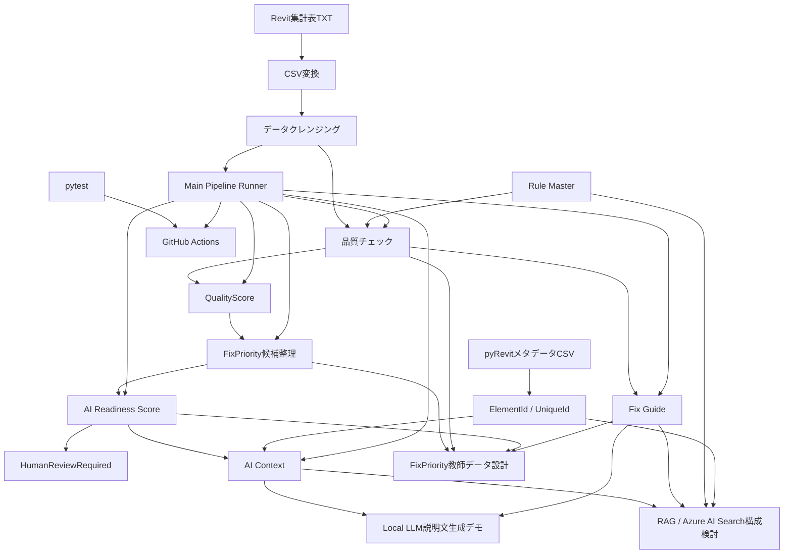

# BIM Data Quality & AI Readiness Assessment PoC

## BIMデータ品質・AI活用準備度評価PoC

Revit / BIMデータを、BI・生成AI・RAG・将来的な機械学習で活用する前に、**データ品質とAI活用準備度を評価するための個人開発PoC**です。

Revit集計表やpyRevitから取得したデータをPythonで処理し、次の流れを検証しています。

```text
BIMデータ取得
→ データクレンジング
→ RuleIdベース品質チェック
→ QualityScore算出
→ AI Readiness Score算出
→ Human Review判定
→ AI Context / Fix Guide生成
```

本PoCでは、AIに設計判断・施工判断・法規判断を任せるのではなく、**BIM担当者が確認・判断しやすい状態へデータを整理すること**を重視しています。

---

## Key Outcomes / 主要成果

### 実装・確認済み

- Revit集計表TXTからのCSV変換とクレンジング
- Door / RoomデータのRuleIdベース品質チェック
- QualityScore算出
- AI Readiness Score算出
- HumanReviewRequired判定
- AI Context JSON / Markdown生成
- Fix Guide Markdown生成
- Streamlitによる簡易可視化
- pyRevitによるElementId / UniqueId取得MVP
- ローカルLLMによる説明文生成デモ
- FixPriority教師データ設計
- FixPriority分類処理経路の確認
- 主要Doorパイプラインの1コマンド実行
- pytestによる44件の自動テスト
- GitHub Actionsによるテスト・パイプライン自動実行

### 設計・検討まで

- Azure AI Searchを想定したRAG構成
- RAG向けチャンク設計
- RAG向けメタデータ設計
- 回答方針・Human Review方針
- FixPriorityを将来の教師データとして扱うための列・ラベル設計

### 対象外・未実装

- Revitモデルの自動修正
- 設計判断、施工判断、法規判断
- Azure AI Searchの実デプロイ
- Azure OpenAI / OpenAI API接続
- Embedding生成・ベクトル検索
- RAGチャットUI
- 複数クラス実データによるFixPriority性能評価
- 実務利用可能なFixPriority自動判定
- 本番用BIM品質管理システム

---

## Portfolio PDF

[Portfolio PDF v005](07_portfolio/bim_quality_poc_portfolio_v005.pdf)

---

## Overall Workflow / 全体フロー


```mermaid
flowchart TD
    A[Revit集計表TXT] --> B[CSV変換]
    B --> C[データクレンジング]
    C --> D[品質チェック]

    R[Rule Master] --> D

    D --> E[QualityScore]
    E --> F[FixPriority候補整理]
    F --> G[AI Readiness Score]

    G --> H[HumanReviewRequired]
    G --> I[AI Context]
    D --> J[Fix Guide]

    I --> K[Local LLM説明文生成デモ]
    J --> K

    I --> L[RAG / Azure AI Search構成検討]
    J --> L
    R --> L

    F --> M[FixPriority教師データ設計]
    D --> M
    G --> M
    J --> M

    P[pyRevitメタデータCSV] --> Q[ElementId / UniqueId]
    Q --> I
    Q --> L

    C --> N[Main Pipeline Runner]
    N --> D
    N --> E
    N --> F
    N --> G
    N --> I
    N --> J

    T[pytest] --> U[GitHub Actions]
    N --> U
```

関連資料：

```text
docs/poc_overall_flow_mermaid.md
docs/phase3_extension_mermaid.md
```

---

## Current Results

### Door Category

| 項目 | 結果 |
| --- | ---: |
| 対象Revit集計表 | 20 ドア 建具表 SD |
| クレンジング後の入力行数 | 25 |
| 品質チェック結果 | 100件 |
| R-001 | 50件 |
| R-002 | 25件 |
| R-003 | 25件 |
| AI Readiness Score | 25要素すべて40 |
| AI Readiness Level | Low |
| HumanReviewRequired | True |
| FixPriority | High: 25 |
| AI Context | 25要素 |
| Main Pipeline | 7ステップ成功 |

Doorサンプルでは、必須パラメータ未入力、分類コード未入力、命名規則違反を検出する設定のため、全要素のAI Readiness Levelが`Low`となっています。

### Room Category

| 項目 | 結果 |
| --- | ---: |
| Total Room records | 113 |
| Room rule violations | 11 |
| Violated Room elements | 11 |
| Clean Room elements | 102 |
| Average Room QualityScore | 99.03 |
| Room AI Readiness Level | High: 113 |
| HumanReviewRequired | True: 11 / False: 102 |

Door中心だった品質チェック・AI Readiness Assessmentを、Room Schedule TXTにも拡張しています。

### pyRevit Metadata Export

| 項目 | 結果 |
| --- | --- |
| Revit / pyRevit環境 | Revit 2024 / pyRevit 6.4.0 |
| BIM Qualityタブ | 作成済み |
| Export Metadataボタン | 作成済み |
| 0件選択時の安全中断 | 確認済み |
| Door 1件選択時のCSV出力 | 確認済み |
| Door複数選択時のCSV出力 | 確認済み |
| ElementId / UniqueId取得 | 確認済み |
| Category / FamilyName / TypeName取得 | 確認済み |
| LevelName取得 | 確認済み |
| 匿名化サンプルCSV | 作成済み |

pyRevit連携は、選択要素のメタデータをCSV出力するMVPです。Revitモデルの自動修正やパラメータ書き換えは行いません。

### FixPriority Workflow

現行の特徴量データでは、FixPriorityが全25件とも`High`であり、単一クラスです。

```text
High: 25
Medium: 0
Low: 0
```

単一クラスでは分類性能を評価できないため、`DummyClassifier`を使用して、次の処理経路だけを確認しています。

```text
特徴量読み込み
→ 分類処理
→ 予測結果生成
→ Classification Report生成
→ Confusion Matrix生成
```

生成確認済み：

```text
04_output_csv/fix_priority_classification_report_v001.csv
04_output_csv/fix_priority_confusion_matrix_v001.csv
04_output_csv/fix_priority_predictions_v001.csv
```

これは、実務で利用できる分類モデルが完成したことを意味するものではありません。

---

## Demo Screenshots

### Streamlit - AI Readiness Assessment

AI Readiness Score、AI Readiness Level、HumanReviewRequired、ElementId別スコアを確認できます。


### Streamlit - AI Context Preview

品質チェック結果、特徴量、AI Readiness Scoreから生成した、AI向け構造化コンテキストを確認できます。


### Streamlit - Fix Guide Preview

RuleId、Severity、AIReadinessImpact、HumanReviewRequiredをもとに生成した修正ガイドを確認できます。


### Revit Sample Model

検証には、Autodesk公式の日本仕様 意匠サンプルモデル Revit 2024を使用しています。

`.rvt`ファイル本体は、容量および配布条件を考慮し、GitHub公開対象外としています。


### Revit Schedule Used

Revit集計表`20 ドア 建具表 SD`をTXTとして書き出し、Python処理の入力データとして使用しています。


### Power BI Dashboard

Power BIは補助的な可視化として使用しています。

`.pbix`ファイル本体はGitHub公開対象外です。


---

## Implemented Extensions

### Local LLM Explanation Demo

AI ContextとFix Guideを入力として、ローカルLLMでBIM担当者向けの説明文を生成できるかを検証しています。

目的はLLM性能比較ではなく、AI Contextが説明文生成の入力として機能するかを確認することです。

```text
docs/local_llm_extension_plan.md
docs/local_llm_prompt_template.md
docs/local_llm_experiment.md
06_local_llm/README.md
06_local_llm/local_llm_prompt_input_sample_v001.md
06_local_llm/local_llm_explanation_examples_v001.md
```

### Room Category Extension

Door中心だった処理をRoomカテゴリにも拡張しています。

```text
src/convert_room_schedule.py
src/clean_room_data.py
src/check_room_quality.py
src/calculate_room_quality_metrics.py
src/calculate_room_ai_readiness_score.py
src/generate_room_ai_context.py
src/generate_room_fix_guide.py
tests/test_room_pipeline.py
```

Room処理は、現在の主要パイプラインランナーには含めていません。

### pyRevit Element Metadata Export

Revitモデル上の選択要素から、ElementId / UniqueIdなどのメタデータをCSV出力します。

```text
pyrevit_scripts/export_selected_element_metadata.py
03_input_csv/pyrevit_element_metadata_sample_v001.csv
tests/test_pyrevit_metadata_csv.py
```

### RAG / Azure AI Search Architecture Design

既存成果物を将来的にRAGで利用する場合の構成を整理しています。

```text
docs/rag_azure_ai_search_architecture_plan.md
docs/rag_chunk_design.md
docs/rag_metadata_design.md
docs/rag_query_examples.md
docs/rag_answer_policy.md
docs/rag_limitations.md
05_rag_design/sample_index_schema_v001.json
05_rag_design/sample_rag_documents_v001.jsonl
```

この段階では、Azure AI Search、Embedding、ベクトル検索、RAGチャットUIは未実装です。

### FixPriority Training Data Design

FixPriorityを将来的な教師データ候補として扱うための列設計・ラベル方針・サンプルを作成しています。

```text
docs/fixpriority_training_data_design.md
docs/fixpriority_training_columns.md
docs/fixpriority_labeling_policy.md
docs/fixpriority_limitations.md
07_fixpriority_training/fixpriority_training_samples_v001.csv
07_fixpriority_training/fixpriority_label_examples_v001.md
tests/test_fixpriority_training_data.py
```

分類処理スクリプト：

```text
src/train_fix_priority_model.py
```

---

## Quick Start / 再現手順

### 前提環境

確認済み環境：

```text
Python 3.12.10
pip 26.1.1
pandas 2.3.3
pytest 9.0.3
scikit-learn 1.8.0
streamlit 1.52.1
```

### 1. リポジトリを取得

```powershell
git clone https://github.com/takahashi-365/bim-quality-poc.git
cd bim-quality-poc
```

### 2. 仮想環境を作成

```powershell
python -m venv .venv
```

### 3. 仮想環境を有効化

```powershell
.\.venv\Scripts\Activate.ps1
```

### 4. 依存関係をインストール

```powershell
python -m pip install --upgrade pip
python -m pip install -r requirements.txt
```

### 5. テストを実行

```powershell
python -m pytest -v
```

確認済み結果：

```text
44 passed
```

### 6. 主要パイプラインを実行

```powershell
python scripts\run_pipeline.py
```

正常終了時：

```text
PIPELINE COMPLETED
Total steps: 7
```

終了コード：

```powershell
$LASTEXITCODE
```

期待結果：

```text
0
```

---

## Main Pipeline Runner

主要なDoor関連処理は、次のランナーから一括実行できます。

```text
scripts/run_pipeline.py
```

実行される処理：

```text
1. BIM quality check
2. Quality metrics calculation
3. BIM feature creation
4. FixPriority model workflow
5. AI readiness assessment
6. AI context generation
7. Fix guide generation
```

対応スクリプト：

```text
src/check_bim_quality.py
src/calculate_quality_metrics.py
src/create_bim_features.py
src/train_fix_priority_model.py
src/calculate_ai_readiness_score.py
src/generate_ai_context.py
src/generate_fix_guide.py
```

ランナーでは、次を確認します。

```text
対象スクリプトの存在
サブプロセスの終了コード
期待する出力ファイルの生成
出力ファイルが0バイトではないこと
失敗時の後続処理停止
CIで利用できる終了コード
```

### 入力に関する注意

主要パイプラインランナーは、次のクレンジング済みDoor CSVから開始します。

```text
03_input_csv/cleaned_bim_data_v001.csv
```

Revit集計表TXTからCSVへの変換、およびDoorデータのクレンジング処理は、一括実行ランナーの対象外です。

---

## Tests and CI

### pytest

主なテスト：

```text
tests/test_quality_rules.py
tests/test_ai_readiness_score.py
tests/test_room_pipeline.py
tests/test_pyrevit_metadata_csv.py
tests/test_fixpriority_training_data.py
tests/test_pipeline_runner.py
```

実行：

```powershell
python -m pytest -v
```

確認済み：

```text
44 passed
```

主な確認内容：

```text
RuleIdベース品質チェック
AI Readiness Score計算
HumanReviewRequired判定
Rule Master必須列
Room用処理
pyRevit出力CSV
FixPriority教師データCSV
主要パイプラインのステップ定義
各スクリプトと出力先の整合性
```

### GitHub Actions

ワークフロー：

```text
.github/workflows/python-ci.yml
```

実行条件：

```text
mainブランチへのpush
mainブランチを対象とするPull Request
GitHub Actions画面からの手動実行
```

CI環境：

```text
Runner: ubuntu-latest
Python: 3.12
Dependency file: requirements.txt
```

CIで実行する処理：

```text
1. リポジトリをチェックアウト
2. Python 3.12をセットアップ
3. pipキャッシュを復元
4. requirements.txtをインストール
5. pytestを実行
6. 主要パイプラインを実行
```

mainブランチ上で、テストと主要パイプラインが正常終了することを確認済みです。

---

## Main Outputs

### Door

```text
04_output_csv/check_results_revit_v002.csv
04_output_csv/quality_metrics_v001.csv
04_output_csv/rule_summary_v001.csv
04_output_csv/category_summary_v001.csv
04_output_csv/element_summary_v001.csv
04_output_csv/bim_features_v001.csv
04_output_csv/ai_readiness_scores_v001.csv
04_output_csv/ai_context_v002.json
04_output_csv/ai_context_v002.md
04_output_csv/fix_guides_v001.md
```

### FixPriority

```text
04_output_csv/fix_priority_classification_report_v001.csv
04_output_csv/fix_priority_confusion_matrix_v001.csv
04_output_csv/fix_priority_predictions_v001.csv
```

### Room

```text
04_output_csv/check_results_room_v001.csv
04_output_csv/room_quality_metrics_v001.csv
04_output_csv/room_ai_readiness_scores_v001.csv
04_output_csv/room_ai_context_v001.json
04_output_csv/room_ai_context_v001.md
04_output_csv/room_fix_guides_v001.md
```

---

## Tech Stack

```text
Python 3.12
pandas
pytest
scikit-learn
Streamlit
CSV
JSON
JSONL
Markdown
Mermaid
Revit Schedule TXT
Revit API
pyRevit
Ollama
LM Studio
Local LLM
Git
GitHub
GitHub Actions
PowerShell
Power BI
```

設計・将来拡張候補：

```text
Azure AI Search
Azure OpenAI
OpenAI API
Embedding
Vector Search
RAG
FastAPI
```

---

## Repository Structure

```text
bim-quality-poc/
├─ .github/
│  └─ workflows/
│     └─ python-ci.yml
├─ 02_rule_master/
├─ 03_input_csv/
├─ 04_output_csv/
├─ 05_rag_design/
├─ 06_local_llm/
├─ 07_fixpriority_training/
├─ 07_portfolio/
├─ app/
├─ docs/
├─ pyrevit_scripts/
├─ scripts/
│  └─ run_pipeline.py
├─ src/
├─ tests/
├─ requirements.txt
└─ README.md
```

---

## Documentation

### 品質評価・データ定義

```text
docs/rule_specification.md
docs/evaluation_policy.md
docs/limitations.md
docs/data_dictionary.md
```

### 再現性・信頼性改善

```text
docs/refactoring_plan.md
docs/phase2/environment_baseline.md
docs/phase2/reproducibility_test_result.md
docs/phase2/pipeline_runner_result.md
docs/phase2/github_actions_ci.md
```

### 拡張設計

```text
docs/local_llm_extension_plan.md
docs/room_category_extension_plan.md
docs/pyrevit_element_metadata_export_plan.md
docs/rag_azure_ai_search_architecture_plan.md
docs/fixpriority_training_data_design.md
```

### 図解・Portfolio

```text
docs/poc_overall_flow_mermaid.md
docs/phase3_extension_mermaid.md
07_portfolio/bim_quality_poc_portfolio_v005.pdf
```

---

## Limitations / Out of Scope

- 本PoCは検証用であり、本番用のBIM品質管理システムではありません。
- 主な対象はDoor ScheduleとRoom Scheduleです。
- QualityScoreとAI Readiness ScoreはPoC用の簡易指標です。
- Door / RoomのElementIdには、PoC用仮IDとRevit内部ElementIdが混在する可能性があります。
- FixPriorityは実務の正解ラベルではなく、仮ラベルです。
- FixPriority教師データは小規模なサンプルです。
- 現行FixPriorityデータは`High`のみの単一クラスです。
- DummyClassifierは処理経路確認のためだけに使用しています。
- 主要ランナーはクレンジング済みDoor CSVを入口としています。
- Room処理は主要ランナーに統合していません。
- Local LLMの出力は参考情報であり、最終判断ではありません。
- pyRevit連携は選択要素のメタデータCSV出力MVPまでです。
- 全モデルスキャンは未実装です。
- Azure AI Search、Embedding、ベクトル検索、RAG UIは未実装です。
- 十分な教師データを用いた本番用機械学習モデルは未実装です。
- Revitモデルの自動修正は行いません。
- 設計判断、施工判断、法規判断の最終判断はBIM担当者が行います。

---

## Security / Public Data Policy

このリポジトリには、公開可能なサンプルデータまたは匿名化したPoC用データのみを含めます。

GitHubに含めないもの：

```text
実案件データ
顧客名
プロジェクト名
個人情報
社外秘モデル由来情報
実モデル由来のUniqueId
実モデル由来のElementId
APIキー
接続文字列
Azureリソース名
.env
ログファイル
モデルファイル
キャッシュ
仮想環境
```

---

## Project Status

```text
Production code / test alignment：Completed
Environment reproducibility：Completed
Main pipeline runner：Completed
GitHub Actions CI：Completed
README reproducibility guide：Completed
pytest：44 passed
Main Pipeline：7 steps completed
GitHub Actions：Success
```

本PoCは、BIM導入支援・Revit運用支援の経験を、建設業界向けのAI・データ活用支援、データ品質管理、AI導入前準備へ拡張するためのポートフォリオです。
