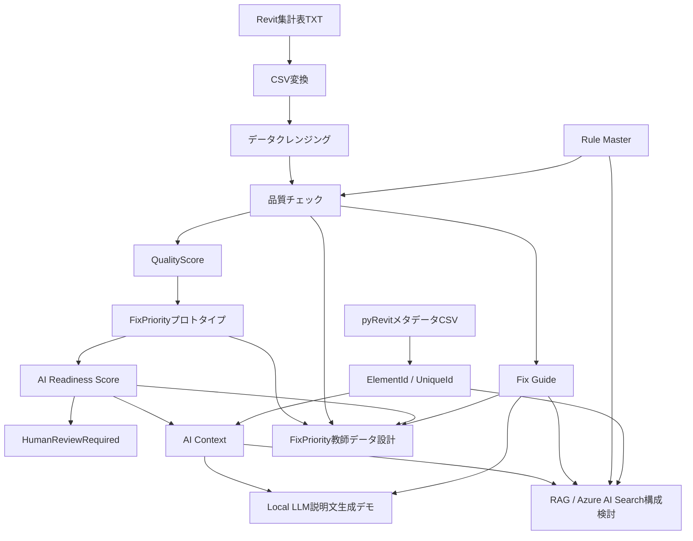

# BIM Data Quality & AI Readiness Assessment PoC

## BIMデータ品質・AI活用準備度評価PoC

A portfolio PoC for assessing BIM data quality and AI readiness before using Revit/BIM data for BI, data analysis, future machine learning, generative AI, or RAG.

Revit/BIMデータを、BI・データ分析・将来的な機械学習・生成AI・RAGで活用する前に、データ品質とAI活用準備度を評価するための個人開発PoCです。

Revit集計表から書き出したTXT、Room Schedule TXT、pyRevitで取得した選択要素メタデータCSVをPythonで処理し、RuleIdベースの品質チェック、QualityScore算出、AI Readiness Score算出、生成AI向け構造化コンテキスト生成、Fix Guide Markdown生成、Streamlitによる簡易可視化、ローカルLLMによる説明文生成デモ、RAG / Azure AI Search構成検討までを扱っています。

---

## 全体フロー図

このPoCは、BIMデータをLLM、RAG、BI、将来的な機械学習で活用する前段階として、データ品質とAI活用準備度を評価するものです。

AIが設計判断・施工判断・法規判断を行うものではなく、Revitモデルの自動修正も行いません。
目的は、BIM担当者が確認・判断しやすいように、品質チェック結果、AI Readiness、修正方針、人間確認要否、RAG向け構造を整理することです。


```mermaid
flowchart TD
    A[Revit集計表TXT] --> B[CSV変換]
    B --> C[データクレンジング]
    C --> D[品質チェック]

    R[Rule Master] --> D

    D --> E[QualityScore]
    E --> F[FixPriorityプロトタイプ]
    F --> G[AI Readiness Score]
    G --> H[HumanReviewRequired]
    G --> I[AI Context]
    D --> J[Fix Guide]

    I --> K[Local LLM説明文生成デモ]
    J --> K

    I --> L[RAG / Azure AI Search構成検討]
    J --> L
    R --> L

    F --> M[FixPriority教師データ設計]
    D --> M
    G --> M
    J --> M

    P[pyRevitメタデータCSV] --> Q[ElementId / UniqueId]
    Q --> I
    Q --> L
```

関連する図解設計資料：

```text
docs/portfolio_visual_plan.md
docs/poc_overall_flow_mermaid.md
docs/phase3_extension_mermaid.md
```

---

## このPoCで示すこと

本PoCの目的は、AIにBIMデータをそのまま判断させることではありません。

BIMデータをAI・データ分析に使う前段階として、以下を整理・構造化することを目的としています。

* BIM品質ルール
* 品質チェック結果
* 重大度
* QualityScore
* AI Readiness Score
* FixPriority
* 修正方針
* 人間確認が必要な箇所
* 生成AIやRAGへ渡すための構造化コンテキスト
* BIM担当者向け説明文生成のための入力設計と人間レビュー
* Revit内部ElementId / UniqueIdを将来のAI Context / RAGメタデータへ接続するための設計
* RAG / Azure AI Searchを想定したチャンク設計・メタデータ設計・回答方針

BIM導入支援・Revit運用支援で扱ってきたデータ品質の課題を、Pythonによるデータ処理、品質評価、AI活用準備度評価、生成AI活用前の構造化、RAG構成検討へ接続することを重視しています。

---

## Portfolio Positioning

本PoCは、BIM導入支援・Revit運用支援の経験を、建設業界向けのAI・データ活用支援へ拡張するためのポートフォリオです。

汎用的なAIモデル開発や深層学習モデルの構築を目的とするものではありません。

BIMデータをBI、データ分析、将来的な機械学習、生成AI、RAGで活用する前段階として必要になる、データクレンジング、ルールベース品質チェック、品質指標化、AI活用準備度評価、構造化コンテキスト生成、修正ガイド生成、ローカルLLMを使った説明文生成検証、RAG / Azure AI Search構成検討の流れを示すことを目的としています。

---

## このPoCで示すスキル

本PoCでは、以下のスキルを示しています。

* BIM導入支援の観点から、BIMデータ品質上の課題を整理できること
* Revit集計表の書き出しデータをPythonで構造化データへ変換できること
* RuleIdベースでBIM品質チェックルールを設計・実装できること
* 品質チェック結果からQualityScore、AI Readiness Scoreを作成できること
* BIMデータをBI、データ分析、将来的な機械学習、生成AI、RAGで活用する前段階として整備できること
* 生成AI向けのJSON / Markdown構造化コンテキストを生成できること
* Fix Guide Markdownを生成し、人間確認向けの修正方針として整理できること
* ローカルLLMに渡す入力サンプルを設計し、Raw LLM OutputとHuman Reviewを分けて記録できること
* pyRevitを使い、Revit選択要素からElementId / UniqueIdなどの基本メタデータを取得できること
* RAG / Azure AI Searchを想定したチャンク設計、メタデータ設計、検索クエリ例、回答方針、制約整理ができること
* Streamlitで説明用MVPを作成できること
* pytestで主要ロジックの最小テストを作成できること
* 制約、未実装範囲、将来拡張を明確に説明できること

---

## なぜ作ったか

BIM導入支援の現場では、Revitモデルを作るだけでなく、BIMデータが後工程で使える品質になっているかが重要になります。

例えば、以下のような状態では、BI、データ分析、将来的な機械学習、生成AI、RAGにそのまま活用しにくくなります。

* 必須パラメータが未入力
* 分類コードが未入力
* 命名規則が統一されていない
* RoomName / RoomNumber / Area / Level などの空間情報が不足している
* ElementId / UniqueIdなどの参照キーが整理されていない
* 属性情報にばらつきがある
* AIに渡す前提条件が整理されていない
* 人間確認が必要な箇所が明確でない
* RAGで検索・回答生成する場合の根拠情報が整理されていない

このPoCでは、BIMデータをAI活用する前に、データ品質、業務上のリスク、AI活用時の阻害要因、RAGで参照すべき根拠情報を整理する流れを検証しています。

---

## 処理フロー

```text
Revit集計表TXT
または pyRevit選択要素メタデータCSV
↓
CSV変換 / メタデータCSV出力
↓
データクレンジング
↓
RuleIdベース品質チェック
↓
品質メトリクス作成
↓
QualityScore算出
↓
特徴量データセット作成
↓
FixPriority分類プロトタイプ
↓
AI Readiness Score算出
↓
AI Context JSON / Markdown生成
↓
Fix Guide Markdown生成
↓
Streamlit簡易画面で可視化
↓
Local LLM説明文生成デモ
↓
Raw LLM Output / Human Review記録
↓
RAG / Azure AI Search構成検討
↓
人間レビュー
```

---

## Current Results

### Door Category Results

現時点のDoorサンプルデータに対する結果は以下です。

| 項目                  |           結果 |
| ------------------- | -----------: |
| 対象Revit集計表          | 20 ドア 建具表 SD |
| クレンジング後の入力行数        |           25 |
| 品質チェック結果            |         100件 |
| AI Readiness Score  |   25要素すべて 40 |
| AI Readiness Level  |          Low |
| HumanReviewRequired |         True |

今回のDoorサンプルでは、必須パラメータ未入力、分類コード未入力、命名規則違反が各要素で検出される設定のため、全要素のAI Readiness LevelがLowとなっています。

---

### Phase 3B Room Category Results

Phase 3Bでは、既存のDoor中心ワークフローをRoomカテゴリにも拡張しました。

| Item                      |                Result |
| ------------------------- | --------------------: |
| Total Room records        |                   113 |
| Room rule violations      |                    11 |
| Violated Room elements    |                    11 |
| Clean Room elements       |                   102 |
| Average Room QualityScore |                 99.03 |
| Room AI Readiness Level   |             High: 113 |
| HumanReviewRequired       | True: 11 / False: 102 |
| pytest                    |             21 passed |

Room workflow:

```text
Room Schedule TXT
↓
CSV conversion
↓
Room data cleansing
↓
Category = Room
↓
Room RuleId checks
↓
Room Quality Metrics
↓
Room AI Readiness Score
↓
Room AI Context
↓
Room Fix Guide
↓
pytest
```

Main Room outputs:

```text
04_output_csv/room_quality_metrics_v001.csv
04_output_csv/room_ai_readiness_scores_v001.csv
04_output_csv/room_ai_context_v001.json
04_output_csv/room_ai_context_v001.md
04_output_csv/room_fix_guides_v001.md
```

Details are documented in:

```text
docs/phase3b_room_category_completion_summary.md
docs/room_category_extension_plan.md
docs/room_schedule_column_mapping.md
docs/room_element_id_policy.md
docs/room_category_policy.md
docs/room_area_handling_policy.md
docs/rule_master_target_category_policy.md
```

---

### Phase 3C pyRevit Element Metadata Export Results

Phase 3Cでは、Revit集計表TXTだけでなく、pyRevitを使ってRevitモデル上の選択要素から内部メタデータを取得する小規模MVPを追加しました。

検証環境：

```text
Revit 2024
pyRevit 6.4.0
```

確認済み：

| Item                               | Result    |
| ---------------------------------- | --------- |
| pyRevit導入                          | 完了        |
| BIM Qualityタブ / Export Metadataボタン | 作成済み      |
| 0件選択時の安全中断                         | 確認済み      |
| Door 1件選択時のCSV出力                   | 確認済み      |
| Door複数選択時のCSV出力                    | 確認済み      |
| ElementId / UniqueId取得             | 確認済み      |
| Category / FamilyName / TypeName取得 | 確認済み      |
| LevelName取得                        | 確認済み      |
| DoorでのRoomName / RoomNumber空欄扱い    | 確認済み      |
| 匿名化サンプルCSV                         | 作成済み      |
| pytest                             | 26 passed |

初期MVPの出力列：

```text
ElementId
UniqueId
Category
FamilyName
TypeName
Name
LevelName
RoomName
RoomNumber
```

主なPhase 3C成果物：

```text
pyrevit_scripts/export_selected_element_metadata.py
03_input_csv/pyrevit_element_metadata_sample_v001.csv
docs/pyrevit_element_metadata_export_plan.md
docs/pyrevit_element_metadata_mapping.md
docs/pyrevit_limitations.md
tests/test_pyrevit_metadata_csv.py
```

Phase 3Cでは、Revitモデルの自動修正やパラメータ書き換えは行っていません。

目的は、Revit内部ElementId / UniqueIdを取得し、既存PoCや将来のAI Context / RAG用メタデータへ接続できる可能性を確認することです。

これらの結果は、小規模なサンプルデータとPoC用ルール設定に基づくものです。

実務上の正式なBIM品質評価基準ではありません。

---

### Phase 3D RAG / Azure AI Search Architecture Design Results

Phase 3Dでは、既存PoC成果物を将来的にRAG / Azure AI Searchで活用する場合の構成検討を追加しました。

この段階では、Azure AI Search、Azure OpenAI / OpenAI API、Embedding生成、ベクトル検索、RAGチャットUIは実装していません。

目的は、AI Context、Fix Guide、Rule Master、Door / Room品質チェック結果、AI Readiness Score、pyRevit Metadataを、将来の検索・回答生成に接続する場合の設計方針を整理することです。

主なPhase 3D成果物：

```text
docs/rag_azure_ai_search_architecture_plan.md
docs/rag_chunk_design.md
docs/rag_metadata_design.md
docs/rag_query_examples.md
docs/rag_answer_policy.md
docs/rag_limitations.md
05_rag_design/sample_index_schema_v001.json
05_rag_design/sample_rag_documents_v001.jsonl
```

Phase 3Dでは、実案件データ、顧客名、個人情報、社外秘モデル由来情報は扱っていません。

RAG回答方針では、設計判断、施工判断、法規適合性の最終判断、Revitモデル自動修正は対象外とし、最終判断はBIM担当者が行う前提としています。

---

## Demo Screenshots

### Streamlit - AI Readiness Assessment

AI Readiness Score、AI Readiness Level、HumanReviewRequired、ElementId別スコアを確認できる画面です。


### Streamlit - AI Context v002 Preview

品質チェック結果、特徴量データセット、AI Readiness Scoreをもとに生成した、AI向け構造化コンテキストを確認できる画面です。


### Streamlit - Fix Guide Preview

RuleId、Severity、AIReadinessImpact、HumanReviewRequiredをもとに生成した、人間確認向けの修正ガイドを確認できる画面です。


### Revit Sample Model

検証には、Autodesk公式の日本仕様 意匠サンプルモデル Revit 2024を使用しています。

`.rvt` ファイル本体は、容量および配布条件を考慮し、GitHub公開対象外としています。


### Revit Schedule Used

本PoCでは、Revit集計表 `20 ドア 建具表 SD` をTXTとして書き出し、Python処理の入力データとして使用しています。


### Power BI Dashboard

Power BIは補助的な可視化として使用しています。

`.pbix` ファイル本体は、容量および公開範囲を考慮し、GitHub公開対象外としています。


---

## 主な機能

詳細なルール仕様、データ辞書、評価方針、制約は `docs/` に整理しています。

### 1. Revit集計表TXTのCSV変換

Autodesk公式の日本仕様Revitサンプルモデルから書き出した集計表TXTを、Python / pandasで品質チェック用CSVへ変換します。

Door入力：

```text
03_input_csv/door_schedule_export_test_v001.txt
```

Door出力：

```text
03_input_csv/door_schedule_converted_v001.csv
```

Room入力：

```text
03_input_csv/room_schedule_export_test_v001.txt
```

Room出力：

```text
03_input_csv/room_schedule_converted_v001.csv
```

---

### 2. データクレンジング

Revit集計表から出力されたデータを、品質チェックしやすい形へ整理します。

主な処理：

* 列名整理
* 必要列抽出
* 欠損値処理
* Category付与
* Door / Room別の基本整形
* PoC用ElementId付与

---

### 3. RuleIdベース品質チェック

BIM品質ルールをRuleIdで管理します。

Doorカテゴリ例：

```text
D-001: Required parameter missing
D-002: Classification code missing
D-003: Naming rule violation
```

Roomカテゴリ例：

```text
R-101: RoomName missing
R-102: RoomNumber missing
R-103: Area missing or zero
R-104: Level missing
```

品質チェック結果は以下へ接続します。

```text
QualityScore
AI Readiness Score
AI Context
Fix Guide
HumanReviewRequired
RAG設計用メタデータ
```

---

### 4. QualityScore算出

品質チェック結果をもとに、要素単位でQualityScoreを算出します。

QualityScoreはBIMデータ品質の参考指標であり、設計品質や施工品質そのものを評価するものではありません。

---

### 5. AI Readiness Score算出

AI Readiness Scoreは、BIMデータをBI、データ分析、将来的な機械学習、生成AI、RAGで利用する前段階として、データがどの程度利用しやすい状態かを示す参考指標です。

AI Readiness Scoreは、以下のような要素をもとに算出します。

```text
QualityScore
RuleId
Severity
HumanReviewRequired
BlockingRuleIds
FixPriority
```

AI Readiness Scoreは、AI利用可否の最終判断ではありません。

---

### 6. AI Context生成

生成AIやRAGへ渡すことを想定した、構造化コンテキストをJSON / Markdownで生成します。

主な出力：

```text
04_output_csv/ai_context_v002.json
04_output_csv/ai_context_v002.md
04_output_csv/room_ai_context_v001.json
04_output_csv/room_ai_context_v001.md
```

AI Contextには、以下のような情報を含めます。

```text
ElementId
Category
RuleId
Severity
QualityScore
AI Readiness Score
HumanReviewRequired
FixPriority
Fix Guide reference
Source file
```

---

### 7. Fix Guide Markdown生成

RuleId、Severity、AI Readinessへの影響、人間確認要否をもとに、BIM担当者向けの修正ガイドMarkdownを生成します。

主な出力：

```text
04_output_csv/fix_guides_v001.md
04_output_csv/room_fix_guides_v001.md
```

Fix Guideは修正命令ではなく、BIM担当者が元モデルや元データを確認するための補助情報です。

---

### 8. Streamlit簡易可視化

Streamlitを使い、AI Readiness Score、AI Context、Fix Guideを確認できる簡易画面を作成しています。

対象：

```text
AI Readiness overview
AI Context preview
Fix Guide preview
```

---

### 9. Local LLM Explanation Demo

Phase 3Aとして、ローカルLLMを使った説明文生成デモを追加しています。

AI ContextとFix Guideを入力情報として、BIM担当者向けの説明文を生成できるかを小さく検証します。

この検証は、LLM性能比較や設計判断の自動化ではありません。

---

### 10. pyRevit Element Metadata Export MVP

Phase 3Cとして、pyRevitを使い、Revitモデル上の選択要素からElementId / UniqueIdなどの基本メタデータをCSV出力するMVPを追加しています。

このMVPは、Revit内部メタデータを既存PoCや将来のAI Context / RAG設計に接続できる可能性を確認するためのものです。

---

### 11. RAG / Azure AI Search Architecture Design

Phase 3Dとして、既存PoC成果物を将来的にRAG / Azure AI Searchで扱う場合の構成検討を追加しています。

この検討では、以下を整理しています。

```text
RAG対象データ
主検索対象 / 補助対象
チャンク設計
メタデータ設計
ElementId / UniqueId / RuleId / Category / SourceFile の関連付け
Azure AI Searchを想定した概念スキーマ
サンプルRAGドキュメント
検索クエリ例
RAG回答方針
制約・セキュリティ方針
```

Phase 3Dは設計検討であり、RAGシステムの本格実装ではありません。

---

## Phase 3A: Local LLM Explanation Demo

Phase 3Aとして、ローカルLLMを使った説明文生成デモを追加しています。

このデモでは、Phase 2で生成した `AI Context v002` と `Fix Guide Markdown` を入力情報として使用し、BIM担当者向けの説明文を生成できるかを小さく検証しています。

目的は、LLMの性能比較や設計判断の自動化ではありません。

ローカルLLMの回答は参考情報であり、最終判断はBIM担当者が行う前提です。

主な関連ファイル：

```text
docs/local_llm_extension_plan.md
docs/local_llm_prompt_template.md
docs/local_llm_experiment.md
06_local_llm/README.md
06_local_llm/local_llm_prompt_input_sample_v001.md
06_local_llm/local_llm_explanation_examples_v001.md
```

---

## Phase 3B: Room Category Extension

Phase 3Bとして、Roomカテゴリを追加しました。

Door中心だった品質チェック・AI Readiness Assessmentを、Room Schedule TXTにも適用できるように拡張しています。

Roomカテゴリでは、以下を扱います。

```text
RoomName
RoomNumber
Area
Level
Category
QualityScore
AI Readiness Score
HumanReviewRequired
Fix Guide
```

主な関連ファイル：

```text
src/convert_room_schedule.py
src/clean_room_data.py
src/check_room_quality.py
src/calculate_room_quality_metrics.py
src/calculate_room_ai_readiness_score.py
src/generate_room_ai_context.py
src/generate_room_fix_guide.py
tests/test_room_pipeline.py
docs/phase3b_room_category_completion_summary.md
docs/room_category_extension_plan.md
docs/room_schedule_column_mapping.md
docs/room_element_id_policy.md
docs/room_category_policy.md
docs/room_area_handling_policy.md
docs/rule_master_target_category_policy.md
```

Room Schedule TXTにはRevit内部ElementId / UniqueIdが含まれていないため、Phase 3BではPoC用の仮ElementIdを使用しています。

Revit内部ElementId / UniqueIdの取得は、Phase 3Cで扱います。

---

## Phase 3C: pyRevit Element Metadata Export MVP

Phase 3Cとして、pyRevitを用いたRevit選択要素メタデータ出力MVPを追加しました。

このMVPでは、Revit上で選択した要素から、Revit API経由で以下の基本メタデータを取得し、CSVとして出力します。

```text
ElementId
UniqueId
Category
FamilyName
TypeName
Name
LevelName
RoomName
RoomNumber
```

実行環境：

```text
Revit 2024
pyRevit 6.4.0
Windows
Python 3.12.10
```

作成したpyRevitスクリプト：

```text
pyrevit_scripts/export_selected_element_metadata.py
```

サンプル出力：

```text
03_input_csv/pyrevit_element_metadata_sample_v001.csv
```

関連docs：

```text
docs/pyrevit_element_metadata_export_plan.md
docs/pyrevit_element_metadata_mapping.md
docs/pyrevit_limitations.md
```

pytest：

```text
tests/test_pyrevit_metadata_csv.py
```

主な確認内容：

* Revit 2024 + pyRevit 6.4.0環境で実行
* pyRevit上に `BIM Quality` タブと `Export Metadata` ボタンを作成
* 選択要素0件の場合はCSVを出力せず安全に中断
* Door要素1件および複数件からCSV出力を確認
* 日本語を含むCSVをUTF-8 with BOMで出力
* GitHub公開用サンプルCSVは匿名化
* DoorではRoomName / RoomNumberを空欄として扱う方針に修正

Phase 3Cでは、Revitモデルの自動修正やパラメータ書き換えは行っていません。

---

## Phase 3D: RAG / Azure AI Search Architecture Design

Phase 3Dとして、RAG / Azure AI Searchを将来利用する場合の構成検討を追加しました。

この検討では、既存PoCで生成したAI Context、Fix Guide、Rule Master、Door / Room品質チェック結果、AI Readiness Score、pyRevit Metadataを、将来の検索対象として扱う場合のチャンク設計、メタデータ設計、検索クエリ例、RAG回答方針、制約を整理しています。

関連docs：

```text
docs/rag_azure_ai_search_architecture_plan.md
docs/rag_chunk_design.md
docs/rag_metadata_design.md
docs/rag_query_examples.md
docs/rag_answer_policy.md
docs/rag_limitations.md
```

サンプル設計ファイル：

```text
05_rag_design/sample_index_schema_v001.json
05_rag_design/sample_rag_documents_v001.jsonl
```

Phase 3Dは設計検討であり、以下は実装していません。

```text
Azure AI Searchの実デプロイ
Azure OpenAI / OpenAI API接続
Embedding生成
ベクトル検索
RAGチャットUI
クラウド環境構築
実案件データ投入
Revitモデル自動修正
設計判断・施工判断の自動化
```

RAG回答方針では、以下を重視しています。

```text
RuleId、Severity、AI Readiness Score、Fix Guide、SourceFileを根拠として示す
HumanReviewRequired=Trueの場合は人間確認が必要と明記する
入力情報にない内容は断定しない
Fix Guideは修正命令ではなく確認・対応案として扱う
LLM回答は参考情報であり、最終判断はBIM担当者が行う
```

---

## 主な出力ファイル

### Door関連

```text
04_output_csv/check_results_revit_v002.csv
04_output_csv/quality_metrics_v001.csv
04_output_csv/ai_readiness_scores_v001.csv
04_output_csv/ai_context_v002.json
04_output_csv/ai_context_v002.md
04_output_csv/fix_guides_v001.md
```

### Room関連

```text
04_output_csv/check_results_room_v001.csv
04_output_csv/room_quality_metrics_v001.csv
04_output_csv/room_ai_readiness_scores_v001.csv
04_output_csv/room_ai_context_v001.json
04_output_csv/room_ai_context_v001.md
04_output_csv/room_fix_guides_v001.md
```

### pyRevit関連

```text
03_input_csv/pyrevit_element_metadata_sample_v001.csv
```

### Local LLM関連

```text
06_local_llm/README.md
06_local_llm/local_llm_prompt_input_sample_v001.md
06_local_llm/local_llm_explanation_examples_v001.md
```

### RAG設計関連

```text
05_rag_design/sample_index_schema_v001.json
05_rag_design/sample_rag_documents_v001.jsonl
```

---

## Tests

pytestで主要ロジックの最小テストを作成しています。

主なテスト：

```text
tests/test_quality_check.py
tests/test_ai_readiness_score.py
tests/test_room_pipeline.py
tests/test_pyrevit_metadata_csv.py
```

実行：

```powershell
python -m pytest tests -v
```

確認済み：

```text
26 passed
```

テストでは、RuleIdベース品質チェック、AI Readiness Score計算、HumanReviewRequired判定、Room用Area抽出、Room用仮ElementId生成、Room出力ファイルの主要列確認、pyRevit出力CSVの必要列確認と基本値確認などの基本動作を確認しています。

Phase 3Dは設計資料とサンプルJSON / JSONLの追加であり、Azure AI Search実装やRAG実行処理は含まないため、現時点では追加の実行テスト対象にはしていません。

---

## Tech Stack

主に使用している技術：

```text
Python
pandas
pytest
Streamlit
Markdown
CSV
JSON
JSONL
Revit Schedule TXT
pyRevit
Revit API
Ollama
LM Studio
Local LLM
```

将来的な拡張候補：

```text
Power BI
Azure AI Search
Azure OpenAI
OpenAI API
Embedding
Vector Search
RAG
FastAPI
```

ただし、Phase 3D時点ではAzure AI Search、Azure OpenAI / OpenAI API、Embedding生成、Vector Search、RAG UIは未実装です。

---

## Repository Structure

```text
bim_quality_poc/
├── README.md
├── requirements.txt
├── 01_data/
├── 02_rule_master/
│   └── bim_rule_master_v003.csv
├── 03_input_csv/
│   ├── door_schedule_export_test_v001.txt
│   ├── door_schedule_converted_v001.csv
│   ├── cleaned_door_data_v001.csv
│   ├── room_schedule_export_test_v001.txt
│   ├── room_schedule_converted_v001.csv
│   ├── cleaned_room_data_v001.csv
│   └── pyrevit_element_metadata_sample_v001.csv
├── 04_output_csv/
│   ├── check_results_revit_v002.csv
│   ├── quality_metrics_v001.csv
│   ├── ai_readiness_scores_v001.csv
│   ├── ai_context_v002.json
│   ├── ai_context_v002.md
│   ├── fix_guides_v001.md
│   ├── check_results_room_v001.csv
│   ├── room_quality_metrics_v001.csv
│   ├── room_ai_readiness_scores_v001.csv
│   ├── room_ai_context_v001.json
│   ├── room_ai_context_v001.md
│   └── room_fix_guides_v001.md
├── 05_powerbi/
├── 05_rag_design/
│   ├── sample_index_schema_v001.json
│   └── sample_rag_documents_v001.jsonl
├── 06_ai_demo/
├── 06_local_llm/
│   ├── README.md
│   ├── local_llm_prompt_input_sample_v001.md
│   └── local_llm_explanation_examples_v001.md
├── 07_portfolio/
│   └── screenshots/
├── docs/
│   ├── project_overview.md
│   ├── rule_specification.md
│   ├── evaluation_policy.md
│   ├── limitations.md
│   ├── data_dictionary.md
│   ├── revit_schedule_column_mapping.md
│   ├── ai_readiness_assessment_plan.md
│   ├── revit_api_pyrevit_integration_plan.md
│   ├── phase3_roadmap.md
│   ├── local_llm_extension_plan.md
│   ├── local_llm_prompt_template.md
│   ├── local_llm_experiment.md
│   ├── room_category_extension_plan.md
│   ├── phase3b_room_category_completion_summary.md
│   ├── room_schedule_column_mapping.md
│   ├── room_element_id_policy.md
│   ├── room_category_policy.md
│   ├── room_area_handling_policy.md
│   ├── rule_master_target_category_policy.md
│   ├── pyrevit_element_metadata_export_plan.md
│   ├── pyrevit_element_metadata_mapping.md
│   ├── pyrevit_limitations.md
│   ├── rag_azure_ai_search_architecture_plan.md
│   ├── rag_chunk_design.md
│   ├── rag_metadata_design.md
│   ├── rag_query_examples.md
│   ├── rag_answer_policy.md
│   └── rag_limitations.md
├── pyrevit_scripts/
│   └── export_selected_element_metadata.py
├── src/
└── tests/
    ├── test_quality_check.py
    ├── test_ai_readiness_score.py
    ├── test_room_pipeline.py
    └── test_pyrevit_metadata_csv.py
```

---

## Documentation

詳細資料は `docs/` に整理しています。

主な資料：

```text
docs/project_overview.md
docs/rule_specification.md
docs/evaluation_policy.md
docs/limitations.md
docs/data_dictionary.md
docs/revit_schedule_column_mapping.md
docs/revit_api_pyrevit_integration_plan.md
docs/ai_readiness_assessment_plan.md

docs/phase3_roadmap.md

docs/local_llm_extension_plan.md
docs/local_llm_prompt_template.md
docs/local_llm_experiment.md

docs/room_category_extension_plan.md
docs/phase3b_room_category_completion_summary.md
docs/room_schedule_column_mapping.md
docs/room_element_id_policy.md
docs/room_category_policy.md
docs/room_area_handling_policy.md
docs/rule_master_target_category_policy.md

docs/pyrevit_element_metadata_export_plan.md
docs/pyrevit_element_metadata_mapping.md
docs/pyrevit_limitations.md

docs/rag_azure_ai_search_architecture_plan.md
docs/rag_chunk_design.md
docs/rag_metadata_design.md
docs/rag_query_examples.md
docs/rag_answer_policy.md
docs/rag_limitations.md
```

---

## Limitations / Out of Scope

現時点の主な制約と対象外は以下です。

* Revit由来データ対応は初期試作です。
* 現在処理しているRevit由来データは、Door ScheduleとRoom Scheduleです。
* Doorカテゴリの `ElementId` はRevit内部ElementIdではなく、建具表上の建具番号を仮IDとして使用しています。
* Roomカテゴリの `ElementId` はRevit内部ElementId / UniqueIdではなく、Phase 3B用の仮IDとして使用しています。
* Room Schedule TXTからは、Zone列とClassificationCode列を初期MVPでは取得していません。
* `FamilyName` と `TypeName` は、現時点ではRevit集計表の列をもとにした仮マッピングです。
* QualityScoreとAI Readiness ScoreはPoC用の簡易指標です。
* FixPriorityは実務の正解ラベルではなく仮ラベルです。
* Local LLM Explanation Demoは、1件のElementIdを対象にした小規模検証です。
* Local LLMの出力は参考情報であり、そのまま最終判断として採用するものではありません。
* pyRevitによる直接取得は、選択要素のメタデータCSV出力MVPまでを実装しています。
* pyRevit連携では、全モデルスキャン、全カテゴリ対応、既存品質チェックパイプラインへの直接投入は未実装です。
* 生成AI API接続、RAGシステム、Azure AI Search連携は未実装です。
* Phase 3Dでは、将来RAG / Azure AI Searchへ接続する場合のチャンク設計、メタデータ設計、検索クエリ例、回答方針、制約整理のみを行っています。
* `05_rag_design/` 配下のJSON / JSONLは、実装用ファイルではなく、概念スキーマと匿名サンプルRAGドキュメントです。
* Azure AI Searchの実デプロイ、Azure OpenAI / OpenAI API接続、Embedding生成、ベクトル検索、RAGチャットUIは未実装です。
* RAG / Azure AI Search構成検討では、実案件データ、顧客名、個人情報、社外秘モデル由来情報を扱いません。
* Revitモデルの自動修正は対象外です。
* 設計判断、施工判断、モデル修正の最終判断は人間が行う前提です。
* 深層学習、機械学習モデルの精度追求、複雑なPower BIダッシュボード再設計は対象外です。

関連docs：

```text
docs/limitations.md
docs/evaluation_policy.md
docs/data_dictionary.md
docs/revit_schedule_column_mapping.md
docs/ai_readiness_assessment_plan.md
docs/phase3_roadmap.md
docs/local_llm_experiment.md
docs/phase3b_room_category_completion_summary.md
docs/pyrevit_element_metadata_export_plan.md
docs/pyrevit_element_metadata_mapping.md
docs/pyrevit_limitations.md
docs/rag_answer_policy.md
docs/rag_limitations.md
```

---

## Security / Public Data Policy

GitHubに含めてよいもの：

```text
公開可能なサンプルデータ
匿名化したPoC用データ
自作サンプルJSON / JSONL
概念スキーマ
設計メモ
制約メモ
```

GitHubに含めないもの：

```text
実案件データ
顧客名
プロジェクト名
個人情報
社外秘モデル由来情報
実モデル由来のUniqueId
実モデル由来のElementId
APIキー
接続文字列
Azureリソース名
.env
ログファイル
モデルファイル
キャッシュ
```

---

## Future Work

今後の拡張候補は以下です。

### Revit / BIM連携

* pyRevitで取得したRevit内部ElementId / UniqueIdの既存PoCへの接続
* UniqueId、FamilyName、TypeName、Category、Level、RoomNameの活用方針整理
* Room要素選択時のRoomName / RoomNumber取得確認
* pyRevit出力CSVを既存品質チェックパイプラインへ接続
* Category = ドア を Door へ正規化する処理
* Wall、Space、Equipmentなど、Room以外のカテゴリへの拡張
* リンクモデル内要素の扱い整理

### AI / RAG連携

* Phase 3Dで整理したチャンク設計・メタデータ設計をもとにしたRAG用前処理の試作
* AI Context / Fix Guide / Rule Masterを検索対象とする小規模RAG検証
* ElementId / UniqueIdを検索キーとして使う場合の実データ接続検討
* HumanReviewRequired=Trueを考慮したRAG回答制御の検討
* Azure AI Searchへ接続する場合のインデックス設計・権限管理・コスト管理の追加検討

### FixPriority / 教師データ設計

* FixPriority仮ラベルの限界整理
* 実務修正履歴を使った教師データ設計
* 修正工数、手戻り有無、後工程影響、レビューコメントの設計
* ActualFixPriorityの定義
* 将来的な分類モデル改善に必要なデータ条件整理

---

## Summary

本PoCでは、Revit / BIMデータを対象に、Python / pandasによるデータ読み込み、データクレンジング、RuleIdベース品質チェック、品質メトリクス作成、QualityScore算出、特徴量データセット作成、AI Readiness Score算出、生成AI向け構造化コンテキスト生成、Fix Guide Markdown生成、Streamlit簡易可視化、ローカルLLMを使った説明文生成デモ、pytestによる最小テストまでを実装しました。

Phase 3Bでは、Door中心だった処理をRoomカテゴリにも拡張し、Room Schedule TXTからRoom品質チェック、Room Quality Metrics、Room AI Readiness Score、Room AI Context、Room Fix Guide、Room用pytestまでを追加しました。

Phase 3Cでは、pyRevitを使ってRevitモデル上の選択要素からElementId / UniqueId / Category / FamilyName / TypeName / LevelNameを取得し、CSVとして出力する小規模MVPを追加しました。出力サンプルはGitHub公開用に匿名化し、CSV構造はpytestで検証しています。

Phase 3Dでは、AI Context、Fix Guide、Rule Master、Door / Room品質チェック結果、AI Readiness Score、pyRevit Metadataを将来的にRAG / Azure AI Searchで扱う場合の構成検討を行いました。チャンク設計、メタデータ設計、検索クエリ例、RAG回答方針、制約・セキュリティ方針をdocsに整理し、概念スキーマJSONと匿名サンプルJSONLを `05_rag_design/` に作成しました。

なお、Azure AI Searchの実装、Embedding生成、ベクトル検索、RAGチャットUI、クラウド接続は本段階では行っていません。

目的は、AIモデルそのものを作ることではなく、BIMデータをBI、データ分析、将来的な機械学習、生成AI、RAGで安全に活用するための前処理、品質評価、構造化、修正ガイド生成、説明文生成、RAG構成検討、人間レビュー設計の流れを示すことです。

このPoCにより、BIM導入支援・Revit運用支援の経験を、建設業界向けのAI・データ活用支援へ拡張できることを示しています。
