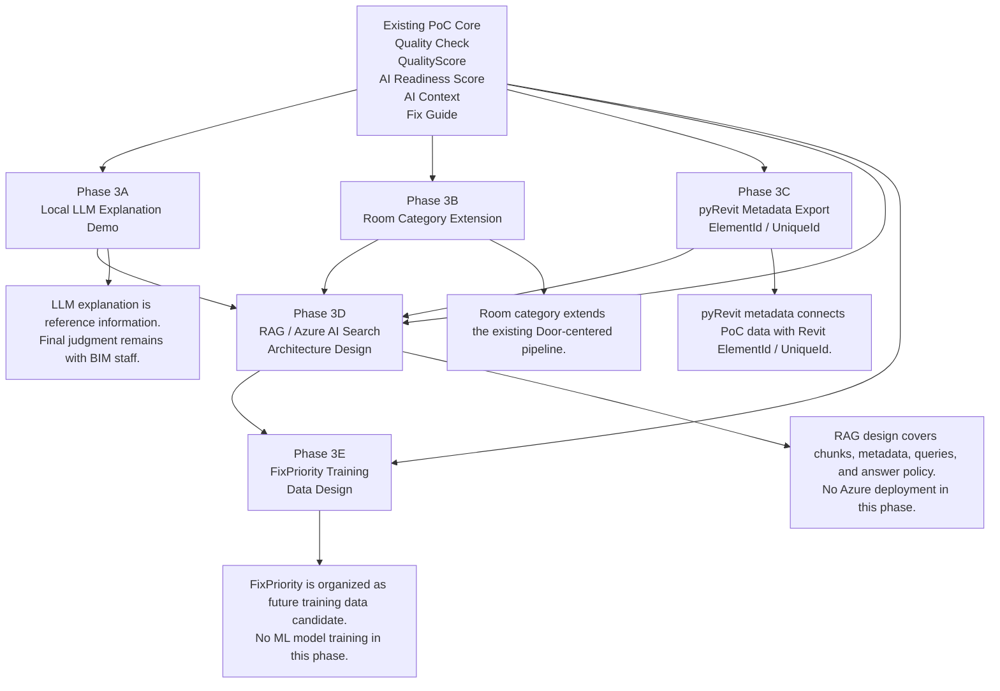
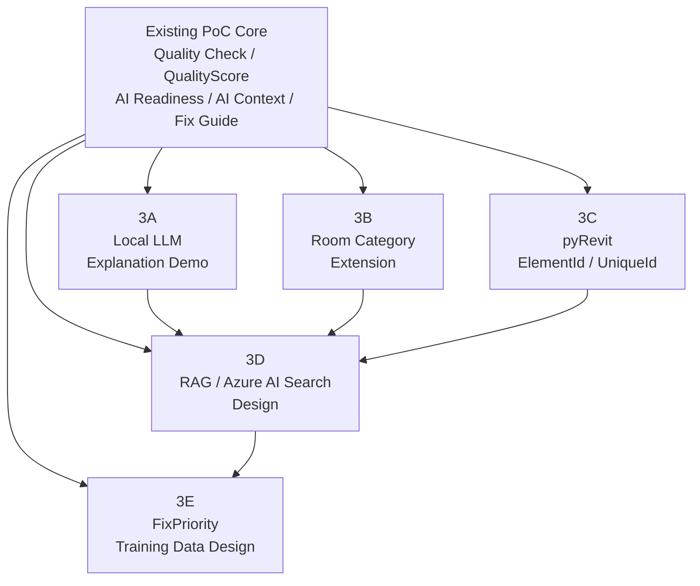

# Phase 3 Extension Mermaid

## 目的

このドキュメントでは、`BIM Data Quality & AI Readiness Assessment PoC` の第3段階A〜Eで追加・整理した拡張内容をMermaidで表現する。

この図は、README、Portfolio PDF、説明資料で利用するための元図案である。

---

## 図の位置づけ

第3段階A〜Eは、新規PoCではなく、既存PoCの拡張である。

既存PoC Coreである品質チェック、QualityScore、AI Readiness Score、AI Context、Fix Guideを土台として、以下の5テーマを追加・整理した。

```text
A：Local LLM Explanation Demo
B：Roomカテゴリ追加
C：pyRevit ElementId / UniqueId取得PoC
D：RAG / Azure AI Search構成検討
E：FixPriority教師データ設計
```

---

## Mermaid案



---

## シンプル版 Mermaid案

READMEでは、詳細注記が多いと見づらい可能性がある。
その場合は以下のシンプル版を使う。



---

## 図で伝えること

この図では、以下を伝える。

```text
第3段階は既存PoCを壊さずに拡張したものである
A〜Eは独立した追加テーマではなく、AI活用前処理という目的でつながっている
Local LLM、Room、pyRevit、RAG、FixPriority教師データ設計まで整理した
各テーマはPoCまたは設計段階であり、本番実装ではない
```

---

## 図で誤解させないこと

この図は、以下を意味しない。

```text
Local LLMが最終判断を行う
Roomカテゴリですべての実案件品質を保証する
pyRevitでRevitモデルを自動修正する
Azure AI Searchを実デプロイ済みである
RAGチャットUIを実装済みである
FixPriorityの機械学習モデルを作成済みである
```

---

## README掲載時の説明文案

READMEに掲載する場合は、図の下に以下の説明を添える。

```text
Phase 3 extends the existing BIM quality and AI readiness PoC into five areas: local LLM explanation, Room category support, pyRevit metadata export, RAG architecture design, and FixPriority training data design.
```

日本語説明：

```text
第3段階では、既存のBIM品質チェック・AI Readiness PoCを土台に、Local LLM、Roomカテゴリ、pyRevit Metadata、RAG構成設計、FixPriority教師データ設計へ拡張しました。
```

---

## Portfolio PDF掲載時の説明文案

Portfolio PDFでは、以下の説明を添える。

```text
第3段階では、既存PoCの品質チェック・AI Readiness・AI Context・Fix Guideの流れを維持しながら、AI説明、Room対応、Revit識別子取得、RAG設計、教師データ設計の5方向へ拡張した。
```

---

## 今後の扱い

このMermaid案は初期図案である。
READMEに直接Mermaidとして掲載するか、PNG化してREADME / Portfolio PDFに掲載するかは後続作業で判断する。
