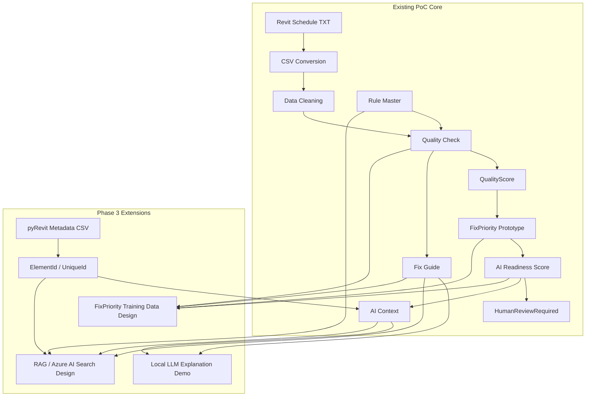

# PoC Overall Flow Mermaid

## 目的

このドキュメントでは、`BIM Data Quality & AI Readiness Assessment PoC` の全体フローをMermaidで表現する。

この図は、README、Portfolio PDF、説明資料で利用するための元図案である。

---

## 図の位置づけ

このPoCは、BIMデータをAI、RAG、BI、将来的な機械学習で活用する前段階として、データ品質、AI Readiness、Fix Guide、HumanReviewRequired、RAG向け構造、FixPriority教師データ設計を整理するものである。

この図では、Revit Schedule TXTやpyRevit Metadataから、品質チェック、AI Readiness、AI Context、Fix Guide、Local LLM、RAG設計、FixPriority教師データ設計までの流れを示す。

---

## Mermaid案



---

## 図で伝えること

この図では、以下を伝える。

```text
BIMデータをAI活用前に品質チェックしている
QualityScoreとAI Readiness Scoreを算出している
HumanReviewRequiredにより人間確認が必要な項目を明示している
AI ContextとFix GuideをLLMやRAGの入力候補として整理している
pyRevit MetadataによりElementId / UniqueIdとの接続を検討している
FixPriorityを将来的な教師データ候補として整理している
```

---

## 図で誤解させないこと

この図は、以下を意味しない。

```text
AIが設計判断を行う
AIが施工判断を行う
AIが法規適合性を最終判断する
Revitモデルを自動修正する
Azure AI Searchを実デプロイ済みである
RAGチャットUIを実装済みである
機械学習モデルを作成済みである
```

---

## README掲載時の説明文案

READMEに掲載する場合は、図の下に以下の説明を添える。

```text
This PoC evaluates BIM data quality and AI readiness before using BIM data for LLM, RAG, BI, or future machine learning workflows. It does not automate design decisions or Revit model modification.
```

日本語説明：

```text
このPoCは、BIMデータをLLM、RAG、BI、将来的な機械学習で活用する前段階として、データ品質とAI利用準備度を評価するものです。設計判断やRevitモデル自動修正は行いません。
```

---

## Portfolio PDF掲載時の説明文案

Portfolio PDFでは、以下の説明を添える。

```text
Revit Schedule TXTとpyRevit Metadataを入力候補とし、品質チェック、QualityScore、AI Readiness Score、AI Context、Fix Guideを生成する流れを整理した。さらに、第3段階ではLocal LLM、RAG設計、FixPriority教師データ設計へ接続する構成を検討した。
```

---

## 今後の扱い

このMermaid案は初期図案である。
READMEに直接Mermaidとして掲載するか、PNG化してREADME / Portfolio PDFに掲載するかは後続作業で判断する。
